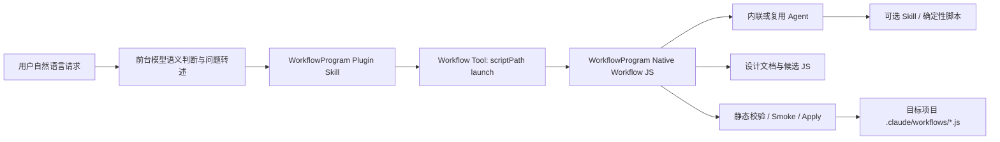
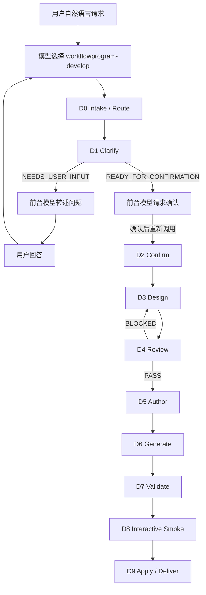
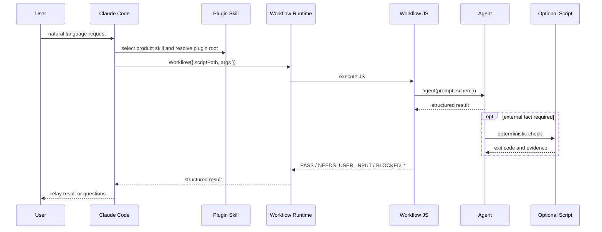

# Native Workflow JS Control Plane High-Level 设计

## 1. 目标与范围

本文定义 WorkflowProgram 控制面迁移到 Claude Code 原生 `Workflow` JS 后的稳态目标架构。

目标：

- WorkflowProgram 自身的 develop、audit、iterate、validate、publish 流程由 `.claude/workflows/*.js` 表达阶段、Agent、顺序、并行、pipeline 和 gate。
- 生成后的目标工作流同样以 `.claude/workflows/*.js` 作为原生可执行控制面。
- 用户仍通过自然语言与模型交互；模型根据语义选择 WorkflowProgram Skill，Skill 解析插件绝对路径后通过 `Workflow({ scriptPath, args })` 启动产品 JS。
- 工作流专属 Agent 默认内联；Skill 和确定性脚本只在需要复用、代码审计或外部事实验证时增加。
- 设计文档经过审视后直接指导 JS 生成，不默认引入 `workflow-spec.yaml` 或 authoring JSON 作为第二份语义真源。
- 保留静态校验、交互式 smoke、受控写入和有副作用阶段的幂等保护。

当前范围只包含交互式 Claude Code CLI。非交互式 `--print`、后台自动化和外部服务调用仍不属于支持范围。

已完成最小能力探针：用户自行编写的 JS 可以在交互式 Claude Code 中通过 `Workflow({ scriptPath })` 执行，并返回结构化 `PASS`。证据见 [Native Workflow Smoke Fixture](../tests/manual-fixtures/native-workflow-smoke/README.md)。

本文只描述稳态架构。迁移顺序见 [Migration Plan](native-workflow-control-plane-migration-plan.md)，实施任务见 [Implementation Plan](native-workflow-control-plane-implementation-plan.md)。

## 2. 背景、基线、约束与关键决策

### 2.1 当前基线

现有 WorkflowProgram 使用 Python 控制面执行 `S0..S6`、`workflow-spec.yaml`、runner、validator、finalizer 和 `.workflowprogram/runtime/`。现有实现仍是 legacy 真源。

仓库已经增加 Native 迁移资产：

- `workflowprogram-develop.js`：M9 产品 develop 控制面，负责可重入 Clarify、Confirm、Design、Review 和宿主侧 evidence handoff。
- `workflowprogram-native-authoring.js`：M7 兼容资产；不再承担 active develop leaf 的主路径控制责任。
- `generate-native-workflow.py`：宿主侧窄化 deterministic renderer；M15 后主路径消费 `workflowprogram-develop.js` 的 `READY_FOR_GENERATION` handoff，旧 `--readiness` 仅保留为兼容回退。
- `build-native-develop-evidence.py`：对 candidate tree 求稳定 hash，并规范化 generation、validation、smoke 和 apply evidence。
- `validate-native-workflow-js.py`：执行轻量静态校验。
- `validate-native-authoring-readiness.py`：M7 兼容 readiness 门禁；当前 active leaf 使用 product handoff，不再以该脚本作为主路径门禁。
- `assess-native-legacy-retirement.py`：M14 事实驱动 Legacy 下线资格评估器。

`workflowprogram-develop.js` 已成为 Native develop 控制面真源。其余原型资产是 renderer 兼容桥，不是最终稳态。

### 2.2 关键决策

| 冲突 | 稳态决策 | 原因 |
|---|---|---|
| WorkflowProgram 自身是否也迁移为 Native Workflow JS | 是 | 迁移控制面意味着 WorkflowProgram 自身各阶段也由 JS 编排，不只是生成目标 JS |
| 多轮澄清是否必须永远留在前台独立逻辑 | 否 | JS 阶段返回 `NEEDS_USER_INPUT` 和问题；前台模型转述后携带答案重新调用，实现可重入澄清 |
| 用户输入、Skill listing、脚本路径是否属于同一接口 | 否 | 用户交互面、Plugin Skill 发现与启动面、Workflow 工具调用面必须分离 |
| 插件内 `workflows/*.js` 是否自动进入 saved workflow registry | 否 | 已观察 CLI 中只能通过绝对 `scriptPath` 启动；`Workflow({ name, args })` 查找失败 |
| Skill 是否是默认入口 | 对插件产品入口是 | Skill 负责语义发现和绝对路径启动；复杂控制顺序仍由 JS 或嵌套 workflow 表达 |
| `workflow-spec.yaml` 是否继续默认生成 | 否 | Native JS 是执行真源；设计文档是审视依据；机器可读 IR 只在确有审计需求时按需增加 |
| 原生 resume 是否足以保证业务副作用安全 | 否 | 原生恢复不自动保证文件写入、发布、外部调用幂等；副作用阶段必须增加窄化保护 |
| smoke 是否仍必要 | 是 | 必须验证 Skill 发现、`scriptPath` launch、Agent、schema、gate、权限、路径和运行时开关共同工作 |

### 2.3 稳态原则

```text
WorkflowProgram
  = native Workflow JS product workflows
  + foreground conversational relay
  + optional reusable skills and agents
  + deterministic validation scripts
  + interactive smoke harness
  + controlled apply and publish qualification
```

## 3. 系统上下文



系统边界：

- 模型负责理解用户自然语言、转述澄清问题和发起 Workflow 工具调用。
- Plugin Skill listing 负责让模型发现 WorkflowProgram 产品入口；Skill 解析插件根目录并提供绝对 `scriptPath`。
- saved workflow registry 仍可发现 project/user 保存的 workflow，并允许按名称调用，但它不是插件产品 JS 的分发契约。
- WorkflowProgram Native JS 负责控制决策、阶段顺序、并行、gate 和返回状态。
- Agent 负责需要模型推理的工作；确定性脚本负责代码审计、文件检查、测试、drift 和外部事实。
- 目标 JS 不依赖 WorkflowProgram 自有通用 runner。

## 4. 用户视图

### 4.1 WorkflowProgram 使用者

1. 用户自然语言描述 develop、audit、iterate、validate 或 publish 需求。
2. 模型根据语义选择对应 WorkflowProgram Skill；Skill 解析绝对路径并启动对应产品 JS。必要时可用显式 slash command 兜底。
3. Workflow JS 发现信息不足时返回 `NEEDS_USER_INPUT` 和问题。
4. 模型将问题转述给用户，收集答案后重新调用同一 workflow。
5. 用户通过 `/workflows` 查看实际后台 Workflow 执行。
6. JS 依次完成设计、审视、生成、校验、smoke、受控写入或发布。

### 4.2 目标工作流使用者

1. Claude Code 通过 registry listing 发现已保存 workflow。
2. 模型按名称调用已保存 workflow；开发和手工 smoke 可以显式使用 `scriptPath`。
3. 用户通过 `/workflows` 查看进度，最终接收稳定 `PASS`、`NEEDS_USER_INPUT` 或 `BLOCKED_*` 结果。迁移期 M8 分发骨架例外返回 `NOT_IMPLEMENTED`。

### 4.3 用户可见失败

| 失败 | 用户反馈 |
|---|---|
| 当前上下文未启用 Workflow | 报告 capability probe 失败，不伪装成脚本错误 |
| M8 插件产品 JS 已分发但业务尚未迁移 | 返回 `NOT_IMPLEMENTED`、`plugin-script-path`、后续迁移里程碑和 legacy delegation 提示 |
| 澄清不足 | 返回 `NEEDS_USER_INPUT` 和结构化问题 |
| 设计审视未闭合 | 返回 `BLOCKED_DESIGN_REVIEW` 和 blocking issues |
| JS 静态校验失败 | 返回规则 ID、文件和修复建议 |
| 交互式 smoke 失败 | 返回失败步骤和证据路径 |
| 文件 drift 或重复副作用风险 | 返回 `BLOCKED_CONFLICT`，停止静默覆盖 |

## 5. 逻辑视图

### 5.1 三个接口平面

| 平面 | 面向对象 | 形式 | 责任 |
|---|---|---|---|
| 用户交互与授权面 | 用户与前台模型 | 自然语言、`ultrawork` 或明确 Workflow 授权、澄清答案、确认 | 表达需求、授权执行与补充上下文 |
| Plugin Skill 发现与启动面 | Claude Code、插件与模型 | `skill_listing`、leaf Skill、解析后的 `${CLAUDE_PLUGIN_ROOT}` | 选择产品能力并生成绝对插件脚本路径 |
| Workflow 工具面 | 模型与 Native runtime | 插件产品使用 `Workflow({ scriptPath, args })`；saved workflow 可使用 `Workflow({ name, args })` | 启动脚本并传入结构化参数 |

在已观察会话中，插件 Skill 会进入 `skill_listing`，插件产品 JS 可以通过绝对 `scriptPath` 调用；同一会话中按 `workflowprogram-develop` 名称查找失败。project/user saved workflow 的按名称能力仍然存在，但属于独立部署模型。用户不需要知道脚本路径，路径解析由 Skill 启动适配层负责。

### 5.2 WorkflowProgram 稳态工作流

| Workflow JS | 职责 | 关键阶段 |
|---|---|---|
| `workflowprogram-develop.js` | 设计或修改目标 workflow | Clarify -> Confirm -> Design -> Review -> Author -> Generate -> Validate -> Smoke -> Apply -> Deliver |
| `workflowprogram-audit.js` | 审计现有 workflow | Discover -> Inspect -> Audit -> Verify -> Report |
| `workflowprogram-iterate.js` | 从 findings、lessons 和现状生成改进提案，并在批准后提升长期约束 | Readback -> Collect Findings -> Build Lessons Delta -> Validate Delta -> Append Lessons -> Propose Constraints -> Review -> Apply Approved Constraints -> Deliver |
| `workflowprogram-validate.js` | 验证目标 workflow | Discover -> Static Validate -> External Verify -> Report |
| `workflowprogram-publish.js` | 发布目标 workflow 插件 | Qualify -> Package -> Verify -> Local Deliver；外部仓库写入按需使用显式批准 adapter |

复杂共享编排通过 `workflow(nameOrRef, args)` 嵌套调用。插件产品 JS 之间不得假设名称已注册；需要嵌套时传入或解析绝对脚本引用，并单独 smoke。简单重复知识或工具使用说明通过 Skill 复用。

### 5.3 组件职责

| 组件 | 职责 | 输入 | 输出 | 失败行为 | 验证边界 |
|---|---|---|---|---|---|
| Semantic Selector | 根据自然语言选择 Plugin Skill 和产品脚本 | 用户请求、Skill listing | Skill 名称、绝对 `scriptPath`、初始 args | 无法判断时要求补充，不猜测 | 路由 smoke |
| Re-entrant Clarifier | 在 JS 内判断信息是否足够 | args、已有答案、目标上下文 | `NEEDS_USER_INPUT` 或 confirmed requirement | 信息不足时提前返回 | schema、澄清 fixture |
| Designer | 生成 High-Level、Low-Level 和控制面设计 | confirmed requirement、目标上下文 | 设计文档、追踪关系 | 关键边界未定义时阻断 | 设计审视 |
| Reviewer | 检查设计闭合与风险 | 设计文档、需求 | verdict、issues | blocker 未关闭时阻断 | schema、JS gate |
| Authoring Spec Agent | 将已审视设计收敛为 run-scoped authoring spec | confirmed requirement、designEvidence、reviewEvidence | `authoringSpec` JSON | spec 缺少 body、重复 meta 或 L3 事实策略不清时阻断 | schema、负例 fixture |
| Generator | 根据 handoff 中的 `authoringSpec` 生成候选 JS | locked handoff、目标目录 | `.claude/workflows/*.js`、按需 assets | spec 与 handoff 不一致时拒绝写候选 | 静态校验 |
| Static Validator | 检查 Native JS 结构规则和 ESM 可加载性 | candidate JS | PASS 或问题清单 | 任一硬错误阻断 smoke | fixture suite、module parse |
| Smoke Harness | 验证真实交互式执行链 | candidate、目标环境 | smoke evidence | 失败时阻断交付 | M11 v1: packet + evaluate；Computer Use 终端驱动 deferred |
| Controlled Apply | 防止漂移和重复副作用 | candidate hash、run ID、manifest、目标文件 | applied manifest 或 conflict | drift 时 `BLOCKED_CONFLICT` | 冲突 fixture |

### 5.4 Agent、Skill 与脚本边界

- 工作流专属 Agent 默认写在 JS 中，并声明 prompt、label、schema 和失败行为。
- 跨 workflow 复用、独立权限、独立调用或长 prompt 版本管理时，才提取 `.claude/agents/*.md`。
- Skill 用于复用知识、工具调用规范、质量标准或确定性能力入口。必须使用时，在 Agent prompt 中显式点名完整 Skill 名称。
- 代码审计、文件检查、测试、drift、checksum 和 manifest 生成应由确定性脚本实现；Skill 可以包装如何调用脚本。
- 复杂复用控制流使用嵌套 workflow，不把控制顺序藏进 Skill。

### 5.5 模型选择策略

M13 已完成按任务类型选择模型的核心实现。

实现要点：

- Agent 声明逻辑任务类型，例如 `repository-exploration`、`architecture`、`risk-review`、`static-review`、`generation`、`clarification`、`complex-generation`、`publish-verification`。
- `resolve-task-model-policy.py` host-side resolver 读取可选 `task-model-policy.json`，将逻辑任务类型映射为运行时可用模型，输出 `task-model-resolution.json` 至 `RUN_ROOT/outputs/stages/`。
- product workflow JS 通过 `withTaskModel(taskType, options)` 助手消费 `args.taskModels`；映射不存在、为空或为 `inherit` 时不传 `model`（默认继承），具体别名才成为 `options.model`。
- 生成后的目标 workflow JS 也必须具备同一控制面：`generate-native-workflow.py` 接受 authoring spec 中的 `task_model_policy`，在目标 JS 中生成 `taskModels` 与 `withTaskModel` 助手，并把设计声明的 `taskType` 映射到每个 Agent 调用；未声明 `taskType` 的 Agent 继续继承当前模型。
- 首版默认使用 `deepseek-v4-flash[1M]` 承担澄清、仓库探索、普通生成和低风险静态复核，使用 `deepseek-v4-pro[1M]` 承担架构设计、复杂生成、风险审查和发布资格复核。策略允许按任务覆盖。
- 未配置或模型不可用时回退到默认继承模型，并记录 `MODEL_ALIAS_UNAVAILABLE` 或 `TASK_TYPE_UNMAPPED` evidence。
- 供应商和版本不散落硬编码在 workflow JS 中。

### 5.6 Authoring 与校验责任收口

FreeSTRIDE 迁移暴露的同类问题统一按机制收口，而不是对单个目标工作流打补丁：

- 目标 JS authoring spec 不再由前台模型自由综合。`workflowprogram-develop.js` 在 Review 之后进入 Author 阶段，由专用 `workflowprogram-develop:author` Agent 返回严格 `authoringSpec`。
- 前台 leaf Skill 只把 `READY_FOR_GENERATION.authoringSpec` 原样写入 `RUN_ROOT/native-workflow-authoring.json`，不得根据 LLD 或聊天上下文重写 JS body。
- Generator 的 `--generation-handoff` 主路径必须验证 handoff 携带 `authoringSpec`，并验证磁盘 spec 与 handoff spec 等价；不一致时在创建 candidate 前失败。
- `body` 是 meta 后的执行体，不是完整 JS 文件。`body` 内出现 `export const meta`、`import`、`require()`、`module.exports` 或重复完整文件头时属于 authoring spec 错误。
- Static Validator 必须做 ESM module parse。正则结构检查只负责 WorkflowProgram 规则，不能替代 Native runtime 可加载性检查；动态代码执行不得用于隐藏宿主工具引用。
- `READY_FOR_SMOKE` 只在 static validation 和 module parse 都 PASS 后出现；否则停在 `BLOCKED_VALIDATION`。

## 6. 运行时视图

### 6.1 Develop 可重入流程



前台模型只负责转述和重新调用，不拥有 gate 逻辑。控制决策由 JS 的状态返回和 gate 决定。

### 6.2 目标 Workflow 执行



### 6.3 验证分层

| 层级 | 负责内容 | 默认实现 |
|---|---|---|
| L1 Schema | 字段存在、类型、枚举和结构 | `agent(..., { schema })` |
| L2 JS Gate | 阈值、覆盖率、重复 ID、状态转移和提前退出 | 普通 JavaScript |
| L3 External Fact | 文件、构建、测试、Git、drift 和报告一致性 | Agent 调用确定性脚本或 CLI |

### 6.4 Resume 与副作用

原生 Workflow journal 和恢复能力用于通用运行恢复，但不视为业务幂等保证。

涉及写入、发布或外部调用时，JS 必须使用：

- `runId`
- `candidateHash`
- `applyManifest`
- 已应用检查
- drift 检查
- 冲突状态 `BLOCKED_CONFLICT`

重复恢复时，如果 manifest 与 candidate hash 一致则跳过已完成副作用；如果目标状态已变化则阻断。

## 7. 数据视图

| 资产 | 分类 | 稳态职责 |
|---|---|---|
| `PLUGIN_ROOT/workflows/workflowprogram-*.js` | `authoritative` | WorkflowProgram 自身产品工作流控制面 |
| `TARGET_ROOT/.claude/workflows/<name>.js` | `authoritative` | 生成后的目标工作流控制面 |
| High-Level / Low-Level 设计文档 | `supporting`、规范性审视依据 | 说明边界，供 JS 生成和审视使用 |
| `.claude/skills/` | `supporting`、可选 | 复用能力说明、工具规范或兼容入口 |
| `.claude/agents/` | `supporting`、可选 | 跨 workflow 复用角色 |
| `.claude/scripts/` | `supporting`、可选 | 确定性校验、manifest、drift 和发布辅助 |
| `.workflowprogram/runs/` | `supporting`、可选 | 运行证据、smoke 结果、apply manifest |
| `.workflowprogram/design/` | `supporting`、可选 | 设计追溯材料 |
| `workflow-spec.yaml` 或其他 IR | `supporting`、可选 | 仅在复杂审计场景按需保留，不是默认 runtime 真源 |
| 当前 `workflowprogram-native-authoring.js`、readiness validator 与 JSON spec compatibility path | `transitional` | 兼容资产保留在脚本、测试和历史文档中；active develop leaf 使用内置 Author 阶段，不再引用它们作为主路径 |
| `READY_FOR_GENERATION.authoringSpec` | `supporting`、run-scoped | 产品 JS Author 阶段的受控生成输入；只用于 deterministic renderer，不是目标 workflow 的长期第二真源 |
| `generate-native-workflow.py` renderer | `supporting` | 作为 deterministic renderer 消费携带 `authoringSpec` 的 `READY_FOR_GENERATION` handoff；`--readiness` 仅为兼容回退 |
| 旧 `.workflowprogram/runtime/` | `historical` / `deprecated` | legacy 兼容，完成验证后移除 |

真相源规则：

- Native Workflow JS 是最终执行真源。
- 设计文档是规范性审视依据，不直接作为运行态解释器输入。
- 可选 IR 必须声明单向生成关系、漂移检测和保留原因，不能成为默认第二真源。

## 8. 部署视图

### 8.1 WorkflowProgram 插件

```text
PLUGIN_ROOT/
├── workflows/
│   ├── workflowprogram-develop.js
│   ├── workflowprogram-audit.js
│   ├── workflowprogram-iterate.js
│   ├── workflowprogram-validate.js
│   └── workflowprogram-publish.js
├── skills/                  # 可选复用能力和兼容入口
├── agents/                  # 可选跨 workflow 角色
└── scripts/                 # 确定性校验、smoke、apply、publish 辅助
    └── assess-native-legacy-retirement.py  # M14 Legacy 下线资格评估
```

### 8.2 目标 workflow 最小部署

```text
TARGET_ROOT/
└── .claude/
    └── workflows/
        └── <workflow-name>.js
```

按需增加 `skills/`、`agents/`、`scripts/` 和 `.workflowprogram/` authoring metadata。

### 8.3 发布资格

目标 workflow 发布前至少满足：

| Gate | 内容 |
|---|---|
| Design Review | JS 与已接受 High-Level / Low-Level 设计一致 |
| Static Validation | meta、phase、schema、gate 和 return envelope 合法 |
| Interactive Smoke | Skill 发现、`scriptPath` launch、Agent、schema、正常 PASS 和 blocker 路径通过 |
| Asset Scope | 只打包 JS 和显式声明的 supporting assets |
| Drift Check | 不静默覆盖用户文件 |
| Manifest | 记录 workflow name、JS path、checksum、验证结果和 smoke evidence |

交互式 smoke 由宿主侧 harness 负责，同时保留人工复核入口。Native JS 只请求 smoke 或消费 smoke evidence，不在后台脚本内直接控制桌面。当前 Computer Use 安全边界禁止自动操作终端应用，因此第一版采用 manual WSL login-shell execution + deterministic JSONL evaluation；未来只有在出现允许的非终端集成后才增加 Computer Use adapter。

M11 第一版已完成宿主侧 `build-native-interactive-smoke.py`，提供 `packet`（生成执行说明）和 `evaluate`（确定性 JSONL 判读）子命令。Computer Use 终端驱动仍 deferred；当前支持 manual WSL login-shell execution + deterministic JSONL evaluation。真实完整产品交互式证据仍需按 fixture 逐条采集。

基础 publish 只生成本地发布包、资格 manifest 和交付计划。GitHub push、marketplace 更新等外部写入必须通过独立 capability probe、用户显式批准和可幂等 adapter，不能混入默认本地发布路径。

M12 已完成确定性 manifest 与资格聚合层：`build-native-workflow-manifest.py` 将 Design Review、Static Validation、Interactive Smoke、Asset Scope、Drift Check 和 Manifest 六个 gate 绑定到同一 `candidateHash`；`validate-publish-qualification.py` 独立重算 candidate checksum 并检查目标 drift。`managed-assets.py` 对相同候选重放执行真正 no-op。外部 GitHub apply 继续复用 M10C 的 `github-publish-target-plugin.py`。

## 9. 质量属性

| 属性 | 要求 | 设计机制 | 验证 |
|---|---|---|---|
| 一致性 | 执行语义只有一个 runtime 真源 | Native JS authoritative；IR 可选 | 静态校验、drift 检测 |
| 可靠性 | gate 不退化为模型自述 | L1 / L2 / L3 分层 | blocked-path、external-fact smoke |
| 可维护性 | 默认部署最小 | 单文件 JS；assets 按需 | 交付树检查 |
| 可观察性 | WorkflowProgram 自身阶段进入 `/workflows` | 产品工作流全部为 Native JS | 交互式 smoke |
| 恢复安全 | 副作用不可重复写入或静默覆盖 | hash、manifest、idempotency check | resume、conflict smoke |
| 成本可控 | 已实现按任务类型选模型 | 可选 model policy | 策略单测、fallback smoke |

## 10. 验证策略

最低验证集：

- capability probe
- Plugin Skill discovery smoke
- saved workflow registry discovery smoke，仅用于 project/user saved workflow 兼容性
- launch smoke
- structured Agent smoke
- schema smoke
- JS gate smoke
- blocked-path smoke
- drift conflict fixture
- Computer Use 交互式 smoke

高风险场景追加：

- parallel smoke
- pipeline smoke
- external-fact smoke
- resume smoke
- publish qualification smoke
- model policy selection 和 fallback smoke，M13 已启用

## 11. 与现有实现的关系

| 当前资产 | 稳态动作 |
|---|---|
| Python runner 和 target runtime | 逐项迁移后删除；仅保留经证明确有必要的窄化脚本 |
| `workflowprogram-native-authoring.js` | 视为 M7 renderer 兼容桥；M9 已由完整 `workflowprogram-develop.js` 替代其控制面责任 |
| JSON authoring spec generator / `--readiness` path | 视为 M7 兼容桥；M15 后 active leaf 使用 `--generation-handoff`，旧路径只在脚本和测试中保留 |
| `build-native-develop-evidence.py` | 保留为窄化宿主侧 adapter；只计算 hash 和规范化证据，不拥有控制顺序 |
| readiness validator | 保留为 M7 兼容脚本；当前主路径由 develop JS 的 `READY_FOR_GENERATION` handoff 和 renderer 校验承担 |
| static validator | 保留 |
| managed-assets | 保留并补充副作用幂等 manifest |
| Skill 路由 | 保留为语义发现辅助和兼容入口，不承担控制顺序 |
| `assess-native-legacy-retirement.py` | M14 事实驱动 Legacy 下线资格评估器；提供 structured disposition/blocker/removalPlan 报告；实际下线 deferred |

## 12. 未决问题

| 问题 | 当前处理 |
|---|---|
| 交互式 smoke 支持哪些终端和操作系统组合 | M11 v1 支持 WSL 手工 login-shell；Windows native 尚未测试；Computer Use 终端驱动 deferred |
| Plugin Skill listing 与 `scriptPath` launch 在不同 Claude Code 版本中的兼容边界 | 每个支持版本执行 discovery 和 launch smoke |
| 可选 IR 在什么复杂度阈值下启用 | 默认关闭；出现明确机器审计需求时单独设计 |
| 任务类型到模型的映射规则 | 已实现；默认继承当前模型 |

## 13. 已观察运行时证据

- [Native Workflow Smoke Fixture](../tests/manual-fixtures/native-workflow-smoke/README.md) 记录了用户自写 JS、`skill_listing`、`Workflow({ scriptPath })` 和结构化 `PASS`。
- [OTel request JSON](D:/Code/otel-raw/0067447e-6ccd-4992-ac1e-2eefdff7b76d.request.json) 中已观察到保存 workflow 按名称调用：`Workflow({"args":"...","name":"plan-hunter"})`。
- [Product Workflow Plugin Script-Path Smoke](../tests/manual-fixtures/native-workflow-product-registration/README.md) 记录了插件产品 JS 的 `Workflow({ scriptPath, args })` 成功调用，以及同一脚本按名称查找失败。该证据将 saved workflow 能力与插件产品分发契约明确分开。
- [Native Develop Re-entrant Blocker Smoke](../tests/manual-fixtures/native-workflow-develop-reentrant/README.md) 记录了 M9 develop JS 在真实交互式 CLI 中执行，并以 `BLOCKED_INPUT` 拒绝缺少必要字段的调用。自动化 PTY 必须继承启用 Native Workflow 的 shell feature flags。

上述证据证明当前交互式 CLI 的已观察行为，不等价于对所有 Claude Code 版本和入口作兼容承诺。

## 14. 过渡原型兼容标记

当前 capability matrix 仍使用以下英文标记识别 M1-M7 原型能力：

- `lightweight static validator`
- `interactive smoke harness`
- `controlled-update support`

这些标记仅用于兼容当前仓库校验。稳态责任仍以本文前述 Native JS、宿主侧 smoke harness 和 controlled apply 契约为准。

M14 新增 `native-legacy-retirement-assessment` schema 与 `assess-native-legacy-retirement.py` 评估器，用于追踪 legacy 资产下线资格。当前仓库稳定返回 `BLOCKED_RETIREMENT`；实际删除 deferred。

M15 新增 `native-workflow-generation-handoff-validation` report，并将 `generate-native-workflow.py` 的主路径切换为 `--generation-handoff`。`transitional-renderer-bridge-active` blocker 只在 active skill/command 引用 M7 兼容资产时触发。M16 关闭 rollback/deprecation anchor 与 legacy routing blocker；当前仓库仅剩完整产品交互式 smoke blocker。

## 15. FreeSTRIDE 迁移反馈后的稳态收敛

FreeSTRIDE 迁移暴露了“候选文件存在但无法真实启动、浅证据仍获得 PASS、手工复制被误判为 managed apply”的系统性风险。稳态架构增加以下约束：

- Native Workflow JS 仍只使用 `args`、`budget`、`phase`、`agent`、`parallel`、`pipeline`、`workflow`、`log` 等已验证原语。`Bash()`、`Read()`、`Write()` 等宿主工具不是 JS 全局变量，必须由 Agent 或确定性脚本承担。
- 静态校验只做高置信度检查：拒绝宿主工具的直接调用或裸引用、拒绝 `eval()` / `Function()` 动态执行、拒绝已知关键未声明标识符，但不宣称替代完整 JavaScript lint。
- Generation 与 Validation 的 PASS 必须来自对应真实 schema 报告，并指向当前 candidate tree 中同一个 `.claude/workflows/*.js` 主脚本；任意 `{"status":"PASS"}` JSON 或同一候选树中不同脚本之间的证据拼接都不是有效 evidence。
- Interactive smoke 的 PASS 必须来自 evaluator 报告，并证明 Workflow 调用、异步启动、非空 run ID、Agent 启动、结构化 schema 输出和预期 completion。生成候选的报告还必须绑定实际调用的 candidate `scriptPath`、`scriptHash`、`candidateHash` 与非空 scenario；`early-blocker` profile 只允许预期状态为 `BLOCKED` 的场景。同名旧脚本的结果不能复用。原始 JSONL 或 transcript 路径不是 smoke evidence。
- Controlled Apply 的 PASS 必须绑定本次 `targetRoot`、真实且持久化的 `managed-change-result`、目标 `.workflowprogram/managed-files.json`、候选文件 hash 覆盖和目标文件当前 hash。`applyManifest` 是结构化对象，不是路径字符串或操作日志描述。
- `supporting_assets` 与 `asset_disposition` 分离：前者只描述候选树中要生成的文件，后者描述 update/migrate 时已有与目标资产的 retain、generate、update、archive、remove、defer 或 not-applicable 决策。
- archive 和 remove 在当前 managed apply 未证明执行前，只能作为显式迁移后续动作，不能在交付结果中宣称已完成。
