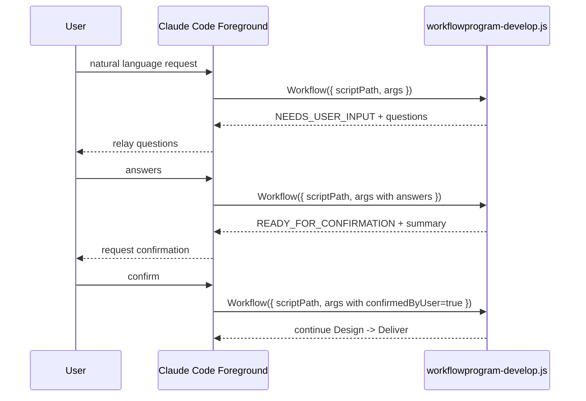
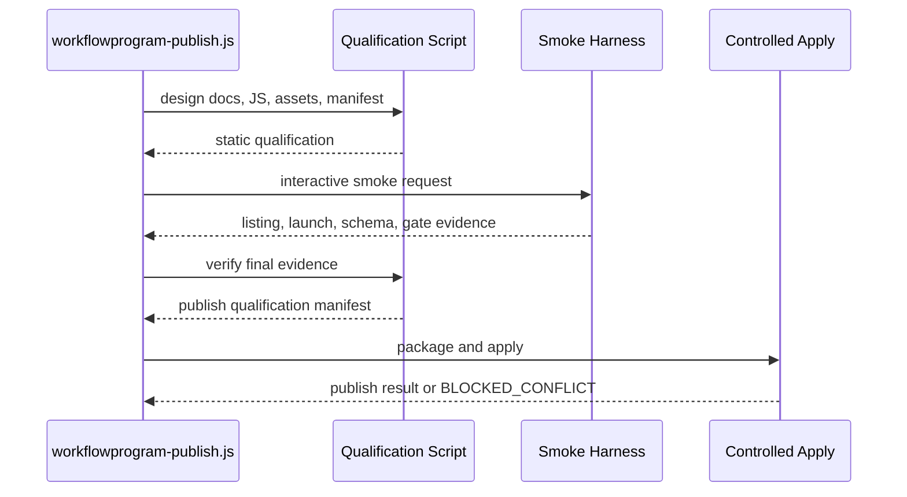

# Native Workflow JS Control Plane Low-Level 设计

## 1. 设计输入与范围

本文将 [Native Workflow JS Control Plane High-Level 设计](native-workflow-control-plane-highlevel-design.md) 下钻为可实施契约。本文描述迁移完成后的稳态；迁移顺序和兼容桥见 [Migration Plan](native-workflow-control-plane-migration-plan.md)。

稳态范围：

- WorkflowProgram 自身的 develop、audit、iterate、validate、publish 使用 Native Workflow JS。
- 生成后的目标 workflow 默认使用单文件 `.claude/workflows/<name>.js`。
- JS 负责控制流；Agent 负责推理；Skill 和脚本负责可选复用能力与确定性外部事实。
- 澄清和确认通过可重入 JS 状态返回衔接前台对话。
- 设计文档经过审视后直接指导 JS 生成，不默认生成 `workflow-spec.yaml` 或 JSON authoring spec。
- 写入、发布和外部副作用具备窄化幂等保护。

当前仓库中的 `workflowprogram-native-authoring.js`、JSON authoring spec generator 和 readiness 前台桥是过渡原型。它们作为迁移输入保留，但不定义稳态。

## 2. HLD 决策映射

| HLD 决策 | LLD 机制 | 产物 | 验证 |
|---|---|---|---|
| WorkflowProgram 自身迁移为 Native JS | 五个产品 workflow JS | `workflows/workflowprogram-*.js` | static validation、interactive smoke |
| 用户交互面与工具调用面分离 | 可重入 args 和稳定返回 envelope | `NEEDS_USER_INPUT`、`READY_FOR_CONFIRMATION` | clarification fixture |
| 插件产品入口由 Skill 启动绝对路径 | Skill 解析插件根目录，正式入口按 `scriptPath` 调用 | Skill listing、产品 JS | discovery、scriptPath launch smoke |
| JS 是执行真源 | 设计文档直接指导 JS 生成；IR 默认关闭 | `.claude/workflows/*.js` | artifact scope check |
| Agent 默认内联 | workflow JS 内声明 prompt、label、schema | 产品 workflow JS | schema audit |
| Skill 和脚本按需 | 明确提取条件和调用边界 | `skills/`、`agents/`、`scripts/` | dependency audit |
| 静态校验与 smoke 保留 | L1 / L2 / L3 分层和交互式 harness | validation report、smoke evidence | fixture suite、交互式 smoke harness |
| 副作用必须幂等 | candidate hash、apply manifest、drift check | apply manifest | conflict、resume fixture |
| M13 已完成：按任务类型选择模型 | 可选 model policy，默认继承模型 | `task-model-policy.json`、`resolve-task-model-policy.py`、`task-model-resolution.json` | policy unit test、fallback smoke |
| M14 已完成：Legacy 下线资格评估 | 确定性事实驱动只读评估器 | `assess-native-legacy-retirement.py`、`native-legacy-retirement-assessment` schema | unit tests、closure fixture |
| M15 已完成：Product handoff renderer 收窄 | `READY_FOR_GENERATION` handoff 成为 renderer 主路径，M7 readiness 仅兼容 | `generate-native-workflow.py --generation-handoff`、`native-workflow-generation-handoff-validation` report | generator/handoff tests、legacy blocker regression |
| M18 已完成：Foreground bypass hardening for READY_FOR_GENERATION | 确定性 `workflowprogram-continue.py` 消费已保存的 JS 结果，unwrap `{result}` envelopes，写入 handoff 文件，调用 generator 和 evidence builder；guard 只允许此脚本在 READY_FOR_GENERATION 状态下的 shell 写入 | `workflowprogram-continue.py`、`workflowprogram-foreground-guard.py` unwrap、`hooks.json` PowerShell/Shell matcher | continuation runner tests、guard unwrap tests、hook config tests |

## 3. 目录、文件与模块结构

### 3.1 WorkflowProgram 插件稳态目录

```text
.claude/
├── workflows/
│   ├── workflowprogram-develop.js
│   ├── workflowprogram-audit.js
│   ├── workflowprogram-iterate.js
│   ├── workflowprogram-validate.js
│   └── workflowprogram-publish.js
├── skills/
│   ├── workflowprogram-orchestrate/       # 可选语义入口和兼容兜底
│   ├── validate-file/                     # 可选确定性脚本调用规范
│   ├── workflow-audit/                    # 可选审计规范
│   └── workflow-spec-support/             # 迁移期保留，稳态重新评估
├── agents/                                # 仅保留跨 workflow 复用角色
└── scripts/
    ├── validate-native-workflow-js.py
    ├── build-native-develop-evidence.py
    ├── build-native-iterate-evidence.py
    ├── build-native-publish-evidence.py
    ├── validate-native-authoring-readiness.py
    ├── managed-assets.py
    ├── validate-publish-qualification.py
    ├── build-native-workflow-manifest.py
    ├── run-interactive-native-smoke.py
    ├── workflowprogram-foreground-guard.py     # M9 已完成 — PreToolUse hook guard
    ├── workflowprogram-continue.py             # M18 已完成 — 确定性 continuation runner
    ├── apply-external-publish.py               # 可选外部发布 adapter
    ├── resolve-task-model-policy.py            # M13 已完成
    └── assess-native-legacy-retirement.py      # M14 已完成
```

脚本名称代表稳态责任。尚未存在的脚本必须在迁移计划中分阶段实现，不能被解释为当前已实现。

### 3.2 目标 workflow 默认目录

```text
TARGET_ROOT/
└── .claude/
    └── workflows/
        └── <workflow-name>.js
```

按需扩展：

```text
TARGET_ROOT/
├── .claude/
│   ├── workflows/
│   ├── skills/
│   ├── agents/
│   └── scripts/
└── .workflowprogram/
    ├── design/
    └── runs/
```

### 3.3 过渡资产

| 资产 | 当前用途 | 稳态动作 |
|---|---|---|
| `workflowprogram-native-authoring.js` | M7 只读 `Explore -> Design -> Review -> Handoff` 原型兼容资产 | 不再作为 active develop leaf 主路径；后续在 legacy 下线条件关闭后删除或保留为显式兼容 workflow |
| `generate-native-workflow.py` JSON authoring spec / renderer | 最小目标 JS generator；M15 后主路径消费 `READY_FOR_GENERATION` product handoff | 保留渲染与静态校验能力；`--generation-handoff` 为主路径，`--readiness` 仅兼容 |
| `build-native-develop-evidence.py` | generation、validation、smoke、apply 报告规范化 | 保留为窄化 adapter；计算 candidate tree hash，不拥有控制顺序 |
| `build-native-iterate-evidence.py` | readback、delta 校验、lessons append、批准后的 constraints apply | 保留为窄化 adapter；复用 `validate-lessons-delta.py`，通过 hash 与 receipt 保证幂等，不拥有控制顺序 |
| `build-native-publish-evidence.py` | qualification、package、verify、local delivery、marketplace 和 external apply 报告规范化 | 保留为窄化 adapter；绑定 target/package hash，不拥有控制顺序 |
| `route-native-control-plane.py` | Native 路由与旧 runtime 标记探测 | M16 后所有目标默认 Native；旧 runtime 标记只产生 `manual_migration_required`，不再转回旧主链 |
| `validate-native-authoring-readiness.py` | M7 前台 readiness 门禁兼容资产 | 不再作为 active develop leaf 主路径；仅在兼容脚本、测试和历史文档中保留 |
| `assess-native-legacy-retirement.py` | M14 legacy 下线资格评估器 | 事实驱动只读评估器；实际下线 deferred |
| `workflowprogram-continue.py` | M18 确定性 continuation runner — 消费已保存的 JS 结果，unwrap `{result}` envelopes，写入 handoff 文件，调用 generator 和 evidence builder | 长期保留；READY_FOR_GENERATION 状态下 foreground 的唯一允许路径 |
| `workflowprogram-foreground-guard.py` | PreToolUse hook 门禁 — 阻断前台对 managed target 路径的直接写入 | 长期保留；M18 增加 `{result}` unwrap 和 READY_FOR_GENERATION continuation 白名单 |

## 4. WorkflowProgram 入口与模式选择

### 4.1 三个平面

| 平面 | 输入 | 输出 | 不变量 |
|---|---|---|---|
| 用户交互面 | 自然语言、问题答案、确认 | 模型转述和结构化 args | 用户不需要知道脚本路径 |
| Plugin Skill 发现与启动面 | `skill_listing`、leaf Skill、解析后的 `${CLAUDE_PLUGIN_ROOT}` | 产品能力、绝对 JS 路径 | 插件 Skill 负责语义发现和路径启动，不承担阶段顺序 |
| Workflow 工具面 | 插件产品使用 `Workflow({ scriptPath, args })`；saved workflow 可使用 `Workflow({ name, args })` | 后台 run、结构化结果 | 插件产品入口必须使用绝对路径；project/user saved workflow 的按名称调用是独立能力 |

### 4.2 产品入口

| 入口 | 默认调用 | 使用场景 |
|---|---|---|
| `workflowprogram-develop` | Skill 解析 `<PLUGIN_ROOT>/workflows/workflowprogram-develop.js`，再调用 `Workflow({ scriptPath, args })` | 创建或修改目标 workflow |
| `workflowprogram-audit` | Skill 解析 `<PLUGIN_ROOT>/workflows/workflowprogram-audit.js`，再调用 `Workflow({ scriptPath, args })` | 审计目标 workflow |
| `workflowprogram-iterate` | Skill 解析 `<PLUGIN_ROOT>/workflows/workflowprogram-iterate.js`，再调用 `Workflow({ scriptPath, args })` | 生成改进提案 |
| `workflowprogram-validate` | Skill 解析 `<PLUGIN_ROOT>/workflows/workflowprogram-validate.js`，再调用 `Workflow({ scriptPath, args })` | 执行验证 |
| `workflowprogram-publish` | Skill 解析 `<PLUGIN_ROOT>/workflows/workflowprogram-publish.js`，再调用 `Workflow({ scriptPath, args })` | 发布目标 workflow |

`workflowprogram-orchestrate` Skill 可以帮助模型从自然语言选择入口。各 leaf Skill 在对应业务迁移阶段切换为 Native 启动适配器：把插件根目录解析成绝对 `scriptPath` 并调用 Workflow，但不承载执行顺序。普通用户不需要输入 slash command。

project/user saved workflow 仍可在 runtime 可发现时使用 `Workflow({ name, args })`。当前已观察 CLI 不会自动把插件打包目录 `workflows/*.js` 注册为 saved workflow，因此 WorkflowProgram 产品入口不得依赖按名称调用。

Develop 主入口的首次调用必须由 leaf Skill 前台适配层自动构造 nested `args`，不得把可推导控制参数转成用户问题：

- `request`：去掉 skill 触发词后的原始用户需求。
- `targetRoot`：用户未显式指定时使用当前 Claude Code 工作目录的绝对路径。
- `runId`：新运行使用稳定 ID，例如 `develop-YYYYMMDD-HHMMSS`；重入时复用已有 ID。
- `runRoot`：`<targetRoot>/.workflowprogram/runs/<runId>`。
- `operation`：已有 workflow 迁移或重构为 `migrate`，已有 Native JS 修改为 `update`，否则为 `create`。
- `clarification`：必须是嵌套对象；migrate 可从空 lenses 开始，由产品 JS 注入迁移默认 lens。

只有用户需求无法确定目标目录、目标 workflow、写入边界或真实外部决策时，才允许返回问题。
当产品 JS 收到 scriptPath-only 或空 args 调用时，它返回 `NEEDS_FOREGROUND_ARGS`
和 `DERIVE_ARGS_AND_REINVOKE`，要求前台按上述规则推导后重入；这不是用户澄清问题。

## 5. Authoring Stage 详细设计

### 5.1 Develop 阶段

| Stage | Purpose | Entry | Actions | Outputs | Gate | Failure | Owned Files | Evidence |
|---|---|---|---|---|---|---|---|---|
| D0 Intake / Route | 识别 create / update 和目标目录 | 初始 args | 读取目标目录，判定 legacy / native 状态 | normalized request | 目标目录明确 | `NEEDS_FOREGROUND_ARGS` 或 `BLOCKED_INPUT` | 无 | route summary |
| D1 Clarify | 收敛七个 logic lenses | normalized request、已有答案 | `requirement-clarification-lead` Agent 基于共享 lens 定义生成缺失问题；JS 判断是否仍需提问 | questions 或 requirement packet | lenses 完整、无开放问题、澄清 agent 输出 schema 合法 | `NEEDS_USER_INPUT` | 可选 run evidence | clarification result、lens coverage |
| D2 Confirm | 获得用户确认 | requirement packet | 检查 `confirmedByUser` | confirmed packet | `confirmedByUser=true` | `READY_FOR_CONFIRMATION` | 可选 run evidence | confirmation result |
| D3 Design | 生成 High-Level 和 Low-Level 设计 | confirmed packet、目标上下文 | 并行探索；串行整合 HLD、LLD、trace | design docs | 边界、输入输出、gate、测试完整 | `BLOCKED_DESIGN` | candidate design docs | design summary |
| D4 Review | 审视设计闭合 | design docs、requirements | 独立 Agent review；JS 过滤 blocker | review verdict、issues | 无 blocker | `BLOCKED_DESIGN_REVIEW` | review report | closure report |
| D5 Author | 生成 run-scoped authoring spec | approved design、review verdict | 专用 Authoring Spec Agent 将设计收敛为严格 JSON，不写文件；小 workflow 输出 `body`，大 workflow 输出 `template + phase_contracts` | `authoringSpec` | schema 合法，`body` 与 `template` 互斥，phase contract 完整，L3 事实边界清楚 | `BLOCKED_GENERATION` | authoring spec | authoring evidence |
| D6 Generate | 生成 Native JS 和按需 assets | `READY_FOR_GENERATION.authoringSpec` | 前台只保存完整 Workflow 结果并运行 `workflowprogram-continue.py`；continuation runner 写 handoff/spec、调用 deterministic renderer、再生成 evidence | candidate tree | 资产范围合规，handoff/spec 匹配 | `BLOCKED_GENERATION` | candidate tree | generation report |
| D7 Validate | 执行 L1 / L2 / L3 校验 | candidate tree | 静态校验、ESM module parse、按需领域脚本 | validation report | 硬错误为零，module parse PASS | `BLOCKED_VALIDATION` | validation report | rule results |
| D8 Smoke | 验证真实交互式运行 | validation PASS | discovery、launch、Agent、schema、gate、blocker smoke | smoke evidence | 最低 smoke PASS | `BLOCKED_SMOKE` | smoke evidence | transcript、JSONL |
| D9 Apply / Deliver | 受控写入并交付 | smoke PASS、apply approved | checksum、drift、idempotency、managed apply、manifest | applied manifest、summary | 无 drift，manifest 一致 | `BLOCKED_CONFLICT` | target assets、manifest | apply report |

### 5.1.1 Clarification, Review, And Foreground Guard Repairs

FreeSTRIDE migration evidence exposed three steady-state contracts that must be
part of `workflowprogram-develop.js`, not just operator guidance:

- D1 clarification receives a `settledPlatformDecisions` list. The registered
  `requirement-clarification-lead` may ask target-specific questions, but must
  not ask the user to re-decide WPN platform policy such as Native Workflow JS as
  runtime truth, workflow-local inline prompts by default, `agent()` option
  limits, or candidate plus managed apply.
- `operation=migrate` seeds missing logic lenses with migration defaults before
  calling the clarification Agent. Missing purpose, object, process, decision,
  evidence, acceptance, and boundary lenses are filled from WPN policy and
  existing-asset discovery rules; unresolved explicit `openQuestions` still
  trigger the Agent.
- The native develop leaf Skill and primary `workflowprogram-develop` Skill own
  canonical `Workflow({ scriptPath, args: {...} })` examples and explicit
  anti-patterns for string args, dotted keys, and scriptPath-only invocation.
  The foreground assistant derives run identifiers, target/run roots, operation,
  and settled migration decisions; users should not hand-author control-plane
  args.
- Exploration prompts treat `migrationDecisions` as settled input. Resolved
  decisions must not be echoed into `userDecisions`, and no-op blocker text such
  as "No true blockers identified" must be represented as `trueBlockers: []`.
- The D3 exploration gate deterministically normalizes migrate-mode
  `userDecisions`: entries already covered by `migrationDecisions` or by
  `assetDispositionHints` are treated as non-blocking confirmations, while
  uncovered topology, evidence-gate, or write-boundary decisions still block
  Design.
- D1 open questions are normalized before the Agent call. Resolved or answered
  objects are ignored; unresolved objects without `question` text get a stable
  fallback question and must never surface as `[object Object]`.
- D4 review treats `requiredRevisions` as blocking evidence. A review result
  with `status=PASS` and non-empty `requiredRevisions` is `BLOCKED_DESIGN_REVIEW`.
- D4 review-fix re-entry uses `reviewFixes` as the canonical correction field.
  Product JS also accepts legacy foreground aliases `designReviewRebuttal`,
  `reviewCorrections`, and `designCorrections`, but normalizes them into the
  design prompt as settled correction input. When prior `explorations` or
  `explorationEvidence` are supplied, D3 must reuse them instead of rerunning
  repository exploration. Stale `reviewEvidence`, `authoringEvidence`,
  `authoringSpec`, generation, validation, smoke, and apply evidence must be
  omitted on review-fix reinvocation.

Foreground bypass is controlled by `workflowprogram-foreground-guard.py` plus
the plugin `PreToolUse` hook:

- `record` persists the latest product JS envelope to
  `TARGET_ROOT/.workflowprogram/session-state.json`;
- `check` blocks direct foreground writes to managed target assets when WPN is in
  `NEEDS_USER_INPUT`, `READY_FOR_CONFIRMATION`, `BLOCKED_*`, or any state that
  requires a controlled script;
- shell commits are allowed only after final `PASS` with
  `deliveryMode=managed-apply` and an `applyManifest` with entries;
- shell commands are treated as foreground writes when they reference managed
  target paths and contain embedded writer APIs such as Python
  `open(..., 'w')`, `Path.write_text`, Node `fs.writeFile*`, PowerShell
  `Set-Content`/`Add-Content`/`Out-File`, or shell `tee`/`touch`/`mkdir`.
  Read-only probes such as `open(...).read()`, `read_text`, `rg`, `cat`, and
  writes under the active `runRoot` candidate tree remain allowed;
- foreground `Agent` / `Task` tool use is blocked when the active transcript's
  latest user request contains WPN / WorkflowProgram Native intent. This makes
  the product Workflow invocation a hook-enforced entry boundary instead of a
  skill-description convention;
- before a foreground guard state exists, WPN / WorkflowProgram Native
  transcripts allow read-only shell probes but block foreground file edits,
  shell writes, and side-effect scripts. Creating run directories, route output
  files, candidate assets, or managed manifests is product Workflow ownership;
- controlled generation, validation, smoke, and apply remain explicit scripts
  selected by the product JS `nextAction`.
- generated target-runtime wrappers delegate shared plugin scripts through a
  cross-platform plugin Python launcher: POSIX hosts keep using
  `bin/workflowprogram-python`, while Windows hosts call `sys.executable`,
  set `CLAUDE_PLUGIN_ROOT` / `CLAUDE_PLUGIN_DATA`, bootstrap plugin-local
  `site-packages` when needed, and prepend that directory to `PYTHONPATH`.

### 5.2 其他产品 workflow

| Workflow | Ordered Stages | 主要输出 |
|---|---|---|
| `workflowprogram-audit.js` | Discover -> Inspect -> Audit -> Verify -> Report | 审计报告、问题和证据 |
| `workflowprogram-iterate.js` | Readback -> Collect Findings -> Build Lessons Delta -> Validate Delta -> Append Lessons -> Propose Constraints -> Review -> Apply Approved Constraints -> Deliver | lessons 增量、改进提案、批准后的长期约束更新 |
| `workflowprogram-validate.js` | Discover -> Static Validate -> External Verify -> Report | 验证报告和稳定 verdict |
| `workflowprogram-publish.js` | Qualify -> Package -> Verify -> Local Deliver -> Optional External Apply | 发布 manifest、smoke evidence、交付摘要 |

### 5.3 Audit、Iterate、Validate、Publish 阶段

| Stage | Purpose | Entry | Actions | Outputs | Gate | Failure | Owned Files | Evidence |
|---|---|---|---|---|---|---|---|---|
| A0 Discover | 定位待审计资产 | audit args | 读取 listing、目标 JS 和 supporting assets | asset inventory | 目标明确 | `BLOCKED_INPUT` | 无 | inventory |
| A1 Inspect | 收集静态结构和依赖 | asset inventory | Agent 读取 JS、Skill、Agent、脚本引用 | findings | 读取完整 | `BLOCKED_AUDIT` | 可选 audit report | inspect evidence |
| A2 Audit | 判断结构、边界和风险 | findings | Agent 按规则审计；JS 聚合 severity | issues、verdict | 结论稳定 | `BLOCKED_AUDIT` | audit report | issue list |
| A3 Verify / Report | 验证证据并交付 | issues、verdict | 按需调用确定性脚本；输出报告 | final audit report | evidence 齐全 | `PASS` 或 `BLOCKED_AUDIT` | audit report | validation evidence |
| I0 Readback | 读取 lessons、当前资产与本轮证据 | iterate args | 读取现状、历史问题、约束和 session findings | readback | 输入完整 | `BLOCKED_INPUT` | 无 | readback summary |
| I1 Collect Findings | 归一化本轮发现 | readback | 聚合 develop / audit / validate / publish findings | findings | 每项可追踪到 run | `BLOCKED_ITERATION` | session findings | findings inventory |
| I2 Build Lessons Delta | 形成短期经验增量 | findings | Agent 分类失败类型、重复问题和候选约束 | lessons delta | 包含 `runId`、`failureKind` | `BLOCKED_ITERATION` | `s6-lessons-delta.md` candidate | delta draft |
| I3 Validate Delta | 校验经验增量结构 | lessons delta | 调用 `validate-lessons-delta.py` | validation report | 硬错误为零 | `BLOCKED_VALIDATION` | validation report | rule IDs |
| I4 Append Lessons | 追加短期经验 | validated delta | 通过受控写入追加 `lessons.md` | lessons append receipt | append 成功 | `BLOCKED_CONFLICT` | `lessons.md` | apply receipt |
| I5 Propose Constraints | 形成长期约束候选 | validated delta、现有约束 | Agent 去重并说明提升理由 | constraint proposal | 每项有来源和理由 | `BLOCKED_ITERATION` | proposal draft | proposal evidence |
| I6 Review | 审视长期约束候选 | constraint proposal | 独立 review；等待用户批准 | reviewed proposal | 无 blocker 且用户批准 | `READY_FOR_CONFIRMATION` 或 `BLOCKED_ITERATION` | proposal report | review verdict |
| I7 Apply Approved Constraints / Deliver | 写入批准后的长期约束并交付 | approved proposal | 通过受控写入更新 `constraints.md`；输出摘要 | improvement summary | 无 drift | `PASS` 或 `BLOCKED_CONFLICT` | `constraints.md`、summary | apply receipt |
| V0 Discover | 定位待验证 workflow | validate args | 读取 JS、assets、目标环境 | validation inventory | 目标明确 | `BLOCKED_INPUT` | 无 | inventory |
| V1 Static Validate | 执行结构规则 | inventory | 调用静态 validator | static report | 硬错误为零 | `BLOCKED_VALIDATION` | validation report | rule IDs |
| V2 External Verify | 验证外部事实 | static PASS | Agent 按需调用测试、构建、Git、领域脚本 | external report | 必需事实 PASS | `BLOCKED_VALIDATION` | external report | command evidence |
| V3 Report | 汇总 verdict | validation reports | JS 聚合结论 | stable verdict | 证据闭合 | `PASS` 或 `BLOCKED_VALIDATION` | validation summary | report |
| P0 Qualify | 检查发布资格 | publish args | 验证设计审视、静态校验、smoke、asset scope、drift 和 manifest | qualification report | 全部 PASS | `BLOCKED_PUBLISH` | qualification report | gate results |
| P1 Package | 构建本地包 | qualification PASS | 串行打包 JS 和显式 assets | local package | scope 合法 | `BLOCKED_PUBLISH` | package tree | package manifest |
| P2 Verify | 验证本地包 | local package | 重跑静态校验和必要 smoke | publish manifest | gate PASS | `BLOCKED_PUBLISH` | publish manifest | smoke evidence |
| P3 Local Deliver | 交付本地包与计划 | publish manifest | 输出本地包、checksum 和后续动作 | deliver summary | manifest 一致 | `PASS` | local package | delivery report |
| P4 Optional External Apply | 显式执行外部写入 | 用户批准、adapter capability PASS | 调用可幂等 adapter 执行 GitHub push 或 marketplace 更新 | external result | 幂等和 drift PASS | `BLOCKED_CONFLICT` 或 `BLOCKED_PUBLISH` | external apply manifest | adapter evidence |

## 6. 目标 Native Workflow JS 文件契约

脚本必须以 pure-literal `meta` 开头：

```javascript
export const meta = {
  name: 'example-workflow',
  description: 'Describe the workflow.',
  phases: [{ title: 'Plan' }, { title: 'Verify' }],
}
```

允许使用：

- `phase(title)`
- `agent(prompt, options)`
- `parallel(thunks)`
- `pipeline(items, stages...)`
- `workflow(nameOrRef, args)`
- 普通 JavaScript 条件、循环、数组聚合和提前返回

约束：

- `meta.phases[*].title` 与源文件中的 `phase(title)` 调用名称集合对齐；`PHASE_ALIGNMENT` 不要求 re-entrant 的每条提前返回路径都执行全部 phase。
- 被 gate 消费的 Agent 字段必须在 schema 中声明。
- 并行 Agent 默认不写相同目录。
- 文件末尾返回稳定 envelope。
- 文件必须通过 ESM module parse；正则静态规则不得替代 Native runtime 可加载性检查。
- 全文件只能出现一个 `export const meta`，且必须在文件开头。authoring spec 的 `body` 只允许包含 meta 后的执行体，禁止包含 `export const meta`、`import`、`module.exports`、`require()` 或完整文件头。
- `pipeline()` 必须以 items 参数开始并接收 stage 函数；若只是串行阶段编排，应使用普通 `await` 和 `phase()`，不得把无 items 的函数序列伪装为 pipeline。
- `parallel()` 必须接收 thunk 集合；不得把已经启动的 Agent promise 或共享写入步骤直接放入同一并行组。
- 不使用 `fs`、`require()`、`process`、`Date.now()`、`Math.random()` 或无参 `new Date()`。
- 插件产品 JS 之间需要嵌套调用时，使用启动层传入或解析后的绝对脚本引用；不得假设 leaf 名称已进入 saved workflow registry。该路径必须增加嵌套 smoke。
- 当目标 workflow 包含可配置模型选择时，JS 必须在 `meta` 后声明 `const taskModels = args?.taskModels || {}` 和 `withTaskModel(taskType, options)` 助手。helper 只在 `args.taskModels[taskType]` 是非空且不等于 `inherit` 时添加 `model`；缺失、空字符串和 `inherit` 均必须省略 `model` 属性。
- `generate-native-workflow.py` 的 authoring spec 可选 `task_model_policy` 字段用于声明生成目标 JS 所需的任务类型映射。该字段不得改变 `meta` 纯字面量头部；只能在 `meta` 后注入 helper，并根据 `agent_task_models` 把声明的 Agent label 映射到逻辑 task type。

### 6.1 Phase 边界判定

`phase(title)` 表示语义执行边界，不是进度标签。一个过程必须具备独立目的，并至少满足以下条件之一，才应成为 Phase 候选：

- 存在明确的输入/输出交接对象。
- 存在出口 gate，可决定继续、阻断、重入、询问用户或触发副作用。
- 存在不同的失败恢复方式或 `nextAction`。
- 位于写入、apply、publish、commit 等副作用边界。
- 需要不同 executor、permission、model 或 tool。
- 需要独立证据类型才能让后续判断可信。

判定句：If completing this process changes whether the workflow continues, blocks, re-enters, asks the user, or performs side effects, it is a Phase candidate.

不要因为单个 prompt 段落、helper 函数、数据转换、同一目标和同一 gate 下的多个并行 Agent、只用于展示进度的切分，或没有独立 gate/evidence/recovery 路径的逻辑而创建 Phase。并行探索通常应保留在同一个 Phase 内，除非其输出被独立消费、独立 gate 或失败恢复方式不同。

### 6.2 Existing Workflow Migration 探索分类

该契约适用于 `operation=migrate`、`request_kind=redesign_existing`、`target_state=existing_managed_workflow` 或 `manual_migration_required=true`。设计和实现中继续使用这些 WPN 术语，不引入新的产品概念。

探索 Agent 必须把结果拆成：

- `findings`：当前事实。
- `constraints`：目标设计必须遵守的约束。
- `migrationTasks`：迁移要完成的工作项。
- `trueBlockers`：无法继续可信设计的真实阻断。
- `userDecisions`：外部用户必须决定、且无法由现有需求、source-of-truth、迁移默认策略或 Design 阶段自行解决的未决决策。
- `sourceOfTruth`：当前行为真源。
- `assetDispositionHints`：`retain | generate | update | archive | remove | defer | not-applicable` 建议。

在 `operation=migrate` 下，`userDecisions` 会先经过确定性归一化。若文本已经被
`requirementSummary.migrationDecisions` 里的已决事项覆盖，或能匹配当前
`assetDispositionHints` 中的路径和处置动作，则视为非阻塞确认项，继续传入
Design/Author 作为上下文；只有未被已决事项或资产处置建议覆盖、且仍会改变拓扑、
证据 gate 或写入边界的 `userDecisions` 才能触发 `BLOCKED_DESIGN`。

探索输出中的内部设计工作不得触发 `BLOCKED_DESIGN`。以下文本形态即使出现在
`userDecisions` 中，也必须被 gate 归一化为 Design work item：

- 12-phase / phase topology / phase mapping / agent naming convention 需要在 Design 中确定。
- gate-to-phase mapping、gate schema、重试策略需要在 Design 中确定。
- phase output intermediate schema 或新增中间产物集合需要在 Design 中确定。
- Python script call strategy、Bash tool strategy 或 subprocess strategy 需要在 Design 中确定。
- task model mapping、smoke fixture 选择、managed-files 计数或 asset disposition 细节需要在 Design 中确定。

这些事项由 Designer 从用户已决输入、现有 command/Agent/Skill、设计文档和历史 runtime
中收敛，不能反复要求真实用户回答。

`removeDotAgentsDir` 的路径语义是确定性的：它只允许处置目标根目录的 `.agents/`
和 `.agentos/` 等临时重复目录，不允许把 `.claude/agents/` 或 `.claude/skills/`
整目录标记为 `remove`。除非 `migrationDecisions.removeClaudeAgentsDir=true`
或 `removeClaudeRegistryDir=true`，Design 后的确定性 policy gate 必须阻断这类
assetDisposition；正式 registry 资产只能 retain/reuse，或在有明确支持资产时按单文件
archive/update/remove。

Design Agent 的 schema 使用长度和数量上限约束：`summary`、`highLevelDesign`、
`lowLevelDesign`、`traceability` 和 `assetDisposition` 都必须保持 implementation-ready
but concise。大型 workflow 应输出 phase contracts 与生成约束，而不是复制完整源文件、
完整 Agent/Skill prompt 或完整 JS body。

以下情况在 migrate 下默认为 `migrationTasks`，不得直接导致 `BLOCKED_DESIGN`：

- 目标 `.claude/workflows/<name>.js` 不存在。
- 旧 `workflow-spec.yaml`、旧设计文档或旧 view 与当前入口不一致。
- `.workflowprogram/runtime/` 需要归档。
- `.workflowprogram/managed-files.json` 需要更新。
- 存在重复或历史遗留资产。
- 没有现成 Native Workflow JS reference。

只有以下情况可进入 `trueBlockers`：

- 目标根目录不可读，或关键资产无法读取。
- 找不到任何可用行为真源。
- 存在未解决用户决策且会改变目标 workflow 拓扑、写入边界或副作用。
- 写入边界不明确，无法判断哪些文件可生成、更新、归档或删除。
- 必须保留的资产缺失且没有替代来源。

真源优先级：

1. 本轮用户明确决策。
2. 当前 command 或实际入口行为。
3. 当前 Agent 与 Skill。
4. 当前设计元数据。
5. 退役 runtime 行为。
6. 历史 candidate 仅作参考。

实现级正反例位于 `.claude/skills/workflowprogram-lowlevel-design/references/examples/`。设计 Native Workflow JS 或迁移已有受管 workflow 时，HLD/LLD 应读取对应样例。

## 7. Agent、Skill 与领域脚本边界

### 7.1 Agent 定义

每个 Agent 定义必须包含：

| 字段 | 说明 |
|---|---|
| `label` | 稳定角色名称 |
| `prompt` | 工作内容、输入、输出和明确约束 |
| `schema` | 结构化输出；gate 消费字段必须存在 |
| `failureBehavior` | schema 失败、外部事实失败和阻断条件 |

M13 已启用 model policy，工作流 JS 通过 `withTaskModel(taskType, options)` 消费映射结果。Product JS 具备最后兜底的默认 task model map：调用方传入 `args.taskModels` 或 `args.taskModelResolution.taskModels` 时以调用方为准；整个映射缺失时使用内置默认值，避免真实 skill 入口遗漏 resolver 后全部继承当前模型。若显式映射中某个 task type 缺失、为空或为 `inherit`，该 Agent 仍省略 `model` 属性以保留精确覆盖能力。

工作流专属 Agent 默认内联。仅在跨 workflow 复用、独立权限、独立调用或长 prompt 独立版本管理时提取 `.claude/agents/*.md`。

### 7.1.1 Authoring Spec Agent

`workflowprogram-develop.js` 必须包含专用 Author 阶段，Agent label 为 `workflowprogram-develop:author`，task type 为 `complex-generation`。该 Agent 只负责把已通过 review 的 HLD/LLD 收敛为 `authoringSpec`，不执行文件写入。

Authoring Spec Agent 的输出 schema：

| 字段 | 约束 |
|---|---|
| `status` | `PASS | BLOCKED` |
| `authoringSpec.name` | `[a-z0-9][a-z0-9-]*` |
| `authoringSpec.description` | 非空字符串 |
| `authoringSpec.phases[]` | 非空 `{title, detail?}`，title 与最终 `phase()` 对齐 |
| `authoringSpec.body` | 小 workflow 使用；meta 后执行体；不得包含 `export const meta` 或完整 JS module header |
| `authoringSpec.template` | 大 workflow 使用；当前允许 `sequential-agent-workflow-v1` |
| `authoringSpec.phase_contracts[]` | 大 workflow 使用；非空 phase contract 列表，与 `body` 互斥 |
| `authoringSpec.supporting_assets` | 默认空；每项必须有 kind/path/content/reason |
| `authoringSpec.task_model_policy.agent_task_models` | 可选 label -> logical task type |
| `blockingIssues` | `status=BLOCKED` 时说明阻断原因 |

Authoring Spec Agent 必须在两种输出形态中选择一种：

- `body` 形态：用于 5 个以内简单 phase、预估 JS body 不超过 15k 字符的 workflow。`body` 是完整可执行体，但不包含 `meta`、`import`、`require()`、`module.exports` 或完整文件头。
- `template + phase_contracts` 形态：用于 6 个以上 phase、迁移型复杂 workflow、或预估 body 超过 15k 字符的 workflow。此形态不得输出 `body`，由 generator deterministic render 目标 JS body，避免 Author agent 的 StructuredOutput 因超长 JS 截断。

`phase_contracts[]` 的每个条目必须满足：

| 字段 | 必填 | 约束 |
|---|---|---|
| `phase` | 是 | phase title，必须与 `authoringSpec.phases[].title` 顺序一致；若 `phases` 为空，generator 从 contracts 派生 |
| `label` | 是 | 唯一 Agent label |
| `prompt` | 是 | 该 phase 的完整 Agent prompt |
| `schema` | 是 | JSON Schema object，gate 消费字段必须声明 |
| `detail` | 否 | phase 描述，写入 `meta.phases[*].detail` |
| `agentType` | 否 | 注册 Agent 类型；仅跨 workflow 复用或独立版本管理时使用 |
| `blockWhen` | 否 | 使用 `result` 变量的 JS 条件表达式，truthy 时提前返回阻断 |
| `blockStatus` | 否 | 阻断状态；缺省为 `BLOCKED` |
| `blockMessage` | 否 | 写入 `blockingIssues` 的说明 |
| `nextAction` | 否 | 阻断后的建议动作 |

Generator 必须在创建 candidate 前验证：`body` 与 `template` 不得同时存在；二者也不得同时缺失；未知 `template` 拒绝；`phase_contracts` 不得为空、不得重复 `phase` 或 `label`，必填字段缺失时返回 `AUTHORING_SPEC_INVALID` 或 handoff 对应错误。模板渲染完成后继续执行既有 `meta` 对齐、module parse、handoff/spec 等价和 task model 注入校验。

前台 Skill 在 Step 4 只能保存产品 JS 返回的完整 Workflow result，然后调用 `workflowprogram-continue.py`。该 runner 从 product-owned `generationHandoff` 或顶层 result 字段派生 `RUN_ROOT/outputs/stages/native-workflow-generation-handoff-input.json` 和 `RUN_ROOT/native-workflow-authoring.json`，再调用 generator。前台不得手写或修补 handoff/spec；如果 `READY_FOR_GENERATION` 不含 `authoringSpec`，或磁盘 spec 与 handoff spec 不一致，generator 必须返回 `BLOCKED_GENERATION`。

### 7.1.2 Requirement Clarification Lead Agent

需求澄清是可复用语义角色，不是前台模型或 JS 内联 prompt 的临时说明。稳态实现必须显式声明：

| 责任面 | 文件或机制 | 责任 |
|---|---|---|
| 入口 Skill | `workflowprogram-develop` / `workflowprogram-native-develop` | 只负责启动 `workflowprogram-develop.js`、转述问题、带用户回答重入 |
| 控制面 JS | `workflowprogram-develop.js` D1/D2 | 决定是否返回 `NEEDS_USER_INPUT` / `READY_FOR_CONFIRMATION`，不得复制完整 lens 方法论 |
| 澄清 Agent | `.claude/agents/requirement-clarification-lead.md` | 拥有七个 logic lenses 的含义、好问题/坏问题、追问顺序、停止条件和输出 schema |
| 共享定义 | `.claude/skills/workflow-spec-support/logic-lenses.md` 与 `scripts/lib/clarification_utils.py::LOGIC_LENSES` | 分别提供人类可读定义和机器可读定义；字段名、title、task、question 必须可追踪 |
| 确定性校验 | `validate-workflow-draft.py`、`validate-native-authoring-readiness.py` 或后继 validator | 检查 lens 覆盖、open questions、用户确认、REQ 映射、process/evidence/acceptance 链接 |

JS 调用必须使用注册角色，例如：

```javascript
await agent(prompt, {
  label: 'workflowprogram-develop:clarify',
  agentType: 'workflowprogram-native-cn:requirement-clarification-lead',
  schema: clarificationSchema
})
```

禁止使用前台 prompt 中的“你是 requirement-clarification-lead / workflow-designer”来代替注册 Agent。若 lens 定义在 `logic-lenses.md` 与 `clarification_utils.py` 之间漂移，验证阶段必须失败或至少产生 blocking issue。

### 7.2 Skill 定义

Skill 适用：

- 多个 Agent 重复使用同一工具或能力规范。
- 需要封装代码审计、测试调用、外部事实获取步骤。
- 需要兼容旧 slash command 或提供语义发现辅助。

Skill 不适用：

- 隐藏阶段顺序、gate 或业务状态机。
- 依赖关键词“碰巧”命中必需能力。

必须使用 Skill 时，Agent prompt 显式写完整 Skill 名称。确定性逻辑实现放在脚本中，Skill 只描述调用契约。

### 7.3 领域脚本

领域脚本适用：

- 文件系统和 checksum 检查。
- 静态规则校验。
- 测试、构建、Git 状态和 drift 检测。
- manifest 生成和 publish qualification。
- 宿主侧交互式 smoke harness 的辅助脚本（M11 v1: `build-native-interactive-smoke.py` packet + evaluate；Computer Use 终端驱动 deferred）。

领域脚本不得重新实现通用 Workflow runner。
Native JS 只请求 smoke 或消费 smoke evidence，不在后台脚本内直接控制桌面。
外部 GitHub push、marketplace 更新等发布副作用也必须经显式批准 adapter 执行，不进入默认本地 publish 路径。

## 8. 接口与协议

### 8.1 Develop Args

```json
{
  "request": "Design or update a workflow.",
  "targetRoot": "<TARGET_ROOT>",
  "runRoot": "<RUN_ROOT>",
  "runId": "<run-id>",
  "operation": "create",
  "clarification": {
    "lenses": {
      "purpose": "Why this workflow exists.",
      "objectModel": "What it reads and produces.",
      "processModel": "Which phases are required.",
      "decisionModel": "Which branches and approvals change execution.",
      "evidenceModel": "Which evidence makes the result trustworthy.",
      "acceptanceModel": "Which scenarios prove behavior.",
      "boundaryModel": "Which stop conditions and non-goals apply."
    },
    "openQuestions": [],
    "confirmedByUser": false
  },
  "designEvidence": null,
  "reviewEvidence": null,
  "generationEvidence": null,
  "validationEvidence": null,
  "smokeEvidence": null,
  "applyApproved": false,
  "applyEvidence": null
}
```

`operation` 枚举：`create | update | migrate`。

`workflowprogram-develop.js` 的运行态 args 继续使用 `purpose`、`objectModel`、`processModel`、`decisionModel`、`evidenceModel`、`acceptanceModel`、`boundaryModel`。旧 S1 草案、`clarification_utils.py` 和 M7 readiness 兼容资产可继续保留 `object_model` 等 snake_case 键，但共享 lens 定义必须声明两者的单向映射，并在 handoff/validator 中拒绝无映射字段。新产品路径不得再新增第三套 lens key。

Native JS 不直接读写文件系统，也不在后台控制桌面。D5-D9 使用可重入 handoff：

| 阶段 | 缺少证据时返回 | 前台或宿主侧动作 | 重新调用时补充 |
|---|---|---|---|
| D5 Author | 内部 Agent 阶段，失败返回 `BLOCKED_GENERATION` | 专用 Authoring Spec Agent 产出 `READY_FOR_GENERATION.authoringSpec`，前台不得自由改写 | `authoringSpec` 或 `authoringEvidence` |
| D6 Generate | `READY_FOR_GENERATION` | 保存完整 Workflow result，运行 `workflowprogram-continue.py`，由 runner 原样落盘 handoff/spec、调用 generator 并构造 `generationEvidence` | `generationEvidence` |
| D7 Validate | `READY_FOR_VALIDATION` | 对 candidate 运行静态校验和按需领域脚本 | `validationEvidence` |
| D8 Smoke | `READY_FOR_SMOKE` | 通过宿主侧 Computer Use 或人工入口运行交互式 smoke | `smokeEvidence` |
| D9 Apply | `READY_FOR_APPLY`，仅当 `applyApproved=true` | 执行 checksum、drift、idempotency 和 managed apply | `applyEvidence` |

证据对象至少包含 `status`。generation PASS 必须包含非空 `candidateRefs`、`sha256:` 形式的 `candidateHash` 和非空 `evidence` 数组。validation、smoke 和 apply PASS 必须回传相同 `candidateHash`，防止旧证据误用于新候选；apply PASS 还必须包含与本次 `targetRoot` 一致的 `targetRoot` 和结构化 `applyManifest`。外部步骤失败时，前台携带 `status != PASS` 和 `blockingIssues` 重新调用，JS 返回对应 `BLOCKED_*`。`applyApproved=false` 时 D8 不执行写入，直接以 `deliveryMode=candidate-only` 交付候选。

其他产品 workflow 使用共同最小 args：

```json
{
  "targetRoot": "<TARGET_ROOT>",
  "runRoot": "<RUN_ROOT>",
  "request": "Audit, iterate, validate, or publish.",
  "applyApproved": false,
  "externalApplyApproved": false
}
```

`externalApplyApproved` 默认 `false`。只有 publish adapter capability 已通过且用户显式批准时，才能进入外部 GitHub push 或 marketplace 更新。

### 8.2 稳定返回 Envelope

```json
{
  "status": "NEEDS_USER_INPUT",
  "workflow": "workflowprogram-develop",
  "runId": "<run-id>",
  "questions": [
    {
      "id": "boundary-001",
      "question": "Which boundary should stop the workflow?",
      "reason": "Changes the JS gate."
    }
  ],
  "blockingIssues": [],
  "evidence": [],
  "nextAction": "REINVOKE_WITH_ANSWERS"
}
```

`status` 枚举：

- `NOT_IMPLEMENTED`：仅允许 M8 分发骨架使用，必须同时返回 `launchMode`、`migrationMilestone` 和 `legacyDelegation`；M9-M10C 业务迁移完成后移除。
- `NEEDS_USER_INPUT`
- `READY_FOR_CONFIRMATION`
- `READY_FOR_GENERATION`
- `READY_FOR_VALIDATION`
- `READY_FOR_EXTERNAL_VERIFY`
- `READY_FOR_AUDIT_DISCOVERY`
- `READY_FOR_AUDIT_VERIFICATION`
- `READY_FOR_ITERATION_READBACK`
- `READY_FOR_LESSONS_DELTA_VALIDATION`
- `READY_FOR_LESSONS_APPEND`
- `READY_FOR_CONSTRAINTS_APPLY`
- `READY_FOR_PUBLISH_QUALIFICATION`
- `READY_FOR_PUBLISH_PACKAGE`
- `READY_FOR_PUBLISH_VERIFICATION`
- `READY_FOR_MARKETPLACE_MERGE`
- `READY_FOR_LOCAL_DELIVERY`
- `READY_FOR_EXTERNAL_APPLY`
- `READY_FOR_SMOKE`
- `READY_FOR_APPLY`
- `PASS`
- `NEEDS_FOREGROUND_ARGS`
- `BLOCKED_INPUT`
- `BLOCKED_DESIGN`
- `BLOCKED_DESIGN_REVIEW`
- `BLOCKED_GENERATION`
- `BLOCKED_VALIDATION`
- `BLOCKED_SMOKE`
- `BLOCKED_CONFLICT`
- `BLOCKED_PUBLISH`
- `BLOCKED_AUDIT`
- `BLOCKED_ITERATION`

`nextAction` 枚举：

- `REINVOKE_WITH_ANSWERS`
- `REINVOKE_WITH_CONFIRMATION`
- `RUN_CONTROLLED_GENERATION`
- `RUN_DETERMINISTIC_VALIDATION`
- `RUN_EXTERNAL_VERIFY`
- `RUN_AUDIT_DISCOVERY`
- `RUN_AUDIT_VERIFICATION`
- `RUN_ITERATION_READBACK`
- `RUN_LESSONS_DELTA_VALIDATION`
- `RUN_CONTROLLED_LESSONS_APPEND`
- `RUN_CONTROLLED_CONSTRAINTS_APPLY`
- `RUN_PUBLISH_QUALIFICATION`
- `RUN_PUBLISH_PACKAGE`
- `RUN_PUBLISH_VERIFICATION`
- `RUN_MARKETPLACE_MERGE`
- `RUN_LOCAL_DELIVERY`
- `RUN_EXTERNAL_PUBLISH_APPLY`
- `RUN_INTERACTIVE_SMOKE`
- `REQUEST_APPLY_APPROVAL`
- `RUN_CONTROLLED_APPLY`
- `FIX_DESIGN_AND_REINVOKE`
- `RESOLVE_CONFLICT`
- `DELIVER`

### 8.3 Apply Manifest

```json
{
  "schemaVersion": 1,
  "workflowName": "example-workflow",
  "runId": "<run-id>",
  "candidateHash": "<sha256>",
  "targetFiles": [
    {
      "path": ".claude/workflows/example-workflow.js",
      "checksum": "<sha256>"
    }
  ],
  "validation": {
    "static": "PASS",
    "smoke": "PASS"
  },
  "smokeEvidence": ["<evidence-path>"],
  "appliedAt": "<explicit timestamp supplied by caller>"
}
```

规则：

- 同一 `candidateHash` 已成功 apply 时跳过重复副作用。
- manifest 缺失、checksum 不一致或目标文件 drift 时返回 `BLOCKED_CONFLICT`。
- 时间戳由调用方显式传入，不在 workflow JS 内使用不确定时间 API。

### 8.4 发布资格 Manifest

```json
{
  "schemaVersion": 1,
  "workflowName": "example-workflow",
  "scriptPath": ".claude/workflows/example-workflow.js",
  "checksum": "<sha256>",
  "designReview": "PASS",
  "staticValidation": "PASS",
  "interactiveSmoke": "PASS",
  "assetScope": "PASS",
  "driftCheck": "PASS",
  "evidence": ["<path>"]
}
```

## 9. 数据结构、Schema 与持久化

### 9.1 设计文档

稳态至少保留：

- High-Level 设计：边界、视图、关键决策、质量属性。
- Low-Level 设计：文件、接口、schema、状态机、错误、测试。
- 设计审视结果：blocking issues、关闭方式和最终 verdict。

设计文档是生成和审视依据。默认不投影为 `workflow-spec.yaml` 或 JSON authoring spec。

### 9.2 可选 IR

只有同时满足以下条件时才增加可选 IR：

- 存在明确机器审计或跨工具交换需求。
- IR 责任不能由 JS、设计文档和 manifest 覆盖。
- 声明单向生成关系和 drift 检测。
- 发布物明确说明 IR 是否需要随目标 workflow 分发。

### 9.3 M13 Model Policy 实现

M13 已实现可选文件：

```json
{
  "schemaVersion": 1,
  "default": "inherit",
  "taskTypes": {
    "clarification": "deepseek-v4-flash[1M]",
    "repository-exploration": "deepseek-v4-flash[1M]",
    "generation": "deepseek-v4-flash[1M]",
    "static-review": "deepseek-v4-flash[1M]",
    "architecture": "deepseek-v4-pro[1M]",
    "complex-generation": "deepseek-v4-pro[1M]",
    "risk-review": "deepseek-v4-pro[1M]",
    "publish-verification": "deepseek-v4-pro[1M]"
  },
  "fallback": "inherit"
}
```

约束：

- host-side resolver 在调用 workflow 前读取 policy，并把解析结果作为 `args.taskModels` 传入。
- workflow JS 不直接读取文件系统，只消费 `args.taskModels[taskType]`；未提供值时省略 `model` 选项。
- 最终通过 Native `agent(..., { model })` 传入已解析模型。
- 嵌套 workflow 必须继续透传 `args.taskModels`，避免子流程重新读取 policy 或产生不同解析结果。
- policy 缺失、别名不可用或宿主不支持时回退 `inherit`，并记录 evidence。
- `workflowprogram-develop.js` 的初始映射应为：两个只读探索 Agent 使用 `repository-exploration`，设计 Agent 使用 `architecture`，独立审查 Agent 使用 `risk-review`。
- M13 已实现 WorkflowProgram 产品 workflow 自身的该能力；调用方可在启动 workflow 前显式执行 resolver 并把结果写入 `args.taskModels`，也可依赖 product JS 的内置默认映射作为最后兜底。
- M17 扩展目标 workflow 生成路径：authoring spec 可以携带 `task_model_policy.agent_task_models`，key 为目标 JS 中的 Agent label，value 为逻辑 task type。renderer 生成目标 JS 时只注入 helper 和声明映射，不解析具体模型；具体模型仍由启动目标 workflow 的调用方通过 `args.taskModels` 提供。

目标 authoring spec 示例：

```json
{
  "task_model_policy": {
    "agent_task_models": {
      "target:explore": "repository-exploration",
      "target:design": "architecture",
      "target:review": "risk-review"
    }
  }
}
```

`resolve-task-model-policy.py` 输出 `RUN_ROOT/outputs/stages/task-model-resolution.json`：

```json
{
  "schemaVersion": 1,
  "status": "PASS",
  "policySource": "<path-or-default>",
  "taskModels": {
    "architecture": "deepseek-v4-pro[1M]",
    "static-review": "deepseek-v4-flash[1M]"
  },
  "fallbacks": [
    {
      "taskType": "publish-verification",
      "requestedModel": "<unavailable-alias>",
      "effectiveModel": "inherit",
      "reason": "MODEL_ALIAS_UNAVAILABLE"
    }
  ]
}
```

约束：
- resolver 只把宿主声明支持的 alias 写入 `taskModels`；未知 alias 转换为 `inherit` 并记录原因。
- JS 不自行猜测可用模型，也不在 Agent 失败后静默切换模型。
- smoke 必须验证显式 alias 透传和 `inherit` fallback 两条路径。

## 10. 状态机、不变量与生命周期

### 10.1 Develop 状态转换

| 当前状态 | 事件 | Guard | 下一状态 | 副作用 | 失败 |
|---|---|---|---|---|---|
| `INTAKE` | 初始调用 | 目标路径明确 | `CLARIFY` | 无 | `BLOCKED_INPUT` |
| `CLARIFY` | lenses 检查 | 信息缺失 | `WAITING_USER_INPUT` | 返回问题 | `NEEDS_USER_INPUT` |
| `CLARIFY` | lenses 检查 | 信息完整 | `WAITING_CONFIRMATION` | 返回摘要 | `READY_FOR_CONFIRMATION` |
| `WAITING_USER_INPUT` | 携带答案重新调用 | 答案可解析 | `CLARIFY` | 无 | `BLOCKED_INPUT` |
| `WAITING_CONFIRMATION` | 携带确认重新调用 | `confirmedByUser=true` | `DESIGN` | 无 | `READY_FOR_CONFIRMATION` |
| `DESIGN` | 设计完成 | 文档完整 | `REVIEW` | 写 candidate docs | `BLOCKED_DESIGN` |
| `REVIEW` | closure review | 无 blocker | `GENERATE` | 写 review report | `BLOCKED_DESIGN_REVIEW` |
| `GENERATE` | 资产生成 | scope 合法 | `VALIDATE` | 写 candidate tree | `BLOCKED_GENERATION` |
| `VALIDATE` | 校验完成 | L1 / L2 / L3 PASS | `SMOKE` | 写 validation report | `BLOCKED_VALIDATION` |
| `SMOKE` | smoke 完成 | 最低 smoke PASS | `WAITING_APPLY_APPROVAL` | 写 smoke evidence | `BLOCKED_SMOKE` |
| `WAITING_APPLY_APPROVAL` | 用户批准 | `applyApproved=true` | `APPLY` | 无 | 无 |
| `WAITING_APPLY_APPROVAL` | 未批准 apply | `applyApproved=false` | `PASS` | 仅交付 candidate，不写目标目录 | 无 |
| `APPLY` | managed apply | checksum 和 drift PASS | `DELIVER` | 写 target files、manifest | `BLOCKED_CONFLICT` |
| `DELIVER` | 输出摘要 | manifest 一致 | `PASS` | 无 | `BLOCKED_CONFLICT` |

### 10.2 不变量

- JS 是最终 runtime 真源。
- 澄清未完成或未经确认时不得进入设计和生成。
- 设计审视 blocker 未关闭时不得生成。
- 静态校验失败时不得 smoke。
- smoke 失败时不得 apply 或 publish。
- 并行 Agent 不得同时写相同目录。
- 默认部署树不得包含旧 `.workflowprogram/runtime/`。
- 写入、发布和外部副作用不得依赖通用 resume 自动幂等。

## 11. 关键流程与时序

### 11.1 可重入澄清



### 11.2 发布资格



## 12. 错误分类、恢复与回滚

| Error | 检测点 | 反馈 | 恢复 | Evidence |
|---|---|---|---|---|
| `NEEDS_FOREGROUND_ARGS` | D0 | 前台未传首轮基础 args | 前台按 entry policy 推导 args 后重新调用，不询问用户 | foreground args policy |
| `BLOCKED_INPUT` | D0 / D1 | 输入不可推导或非法 | 补充 args 后重新调用 | clarification report |
| `NEEDS_USER_INPUT` | D1 | 结构化问题 | 前台转述并重新调用 | questions |
| `READY_FOR_CONFIRMATION` | D2 | 需求摘要 | 用户确认后重新调用 | requirement packet |
| `BLOCKED_DESIGN` | D3 | 设计边界不完整 | 补充设计后重跑 | design summary |
| `BLOCKED_DESIGN_REVIEW` | D4 | blocker 列表 | 修改设计后重跑 | closure report |
| `AUTHORING_SPEC_INVALID` | D5 / generator | spec 缺字段、body 含完整文件头或不匹配 handoff | 修复 Author 阶段输出并重新调用 | authoring spec validation report |
| `BLOCKED_GENERATION` | D5 / D6 | 生成或资产范围错误 | 修复 authoring spec 或生成逻辑后重跑 | generation report |
| `MODULE_PARSE_FAILED` | D7 | JS 无法作为 ESM module 加载 | 修复 body 或 helper 后重新生成 | static validation report |
| `DUPLICATE_META_EXPORT` | D7 | 多个 `export const meta` | 保留 generator 生成的唯一 meta，body 只写执行体 | static validation report |
| `BLOCKED_VALIDATION` | D7 | 规则 ID 和证据 | 修复 JS 或脚本 | validation report |
| `BLOCKED_SMOKE` | D8 | smoke 步骤和 transcript | 修复环境或 JS | smoke evidence |
| `BLOCKED_CONFLICT` | D9 / publish | drift、checksum、manifest 差异 | 人工合并或重新生成 | conflict report |
| `BLOCKED_PUBLISH` | publish | 资格 gate 缺失 | 补充验证后重跑 | qualification report |
| `BLOCKED_AUDIT` | audit | 审计输入、证据或结论不完整 | 补充输入或修复审计规则 | audit report |
| `BLOCKED_ITERATION` | iterate | 提案缺少原因、证据或审视结论 | 补充提案后重跑 | proposal report |

恢复原则：

- 通用中断恢复使用 Native Workflow runtime。
- 有副作用阶段先检查 apply manifest，再决定跳过、继续或阻断。
- 回滚使用上一个已验证 manifest 和版本控制，不静默覆盖用户变更。

## 13. 配置、依赖与部署细节

- Native Workflow JS 依赖 Claude Code Workflow runtime。
- 静态校验、drift、manifest、smoke harness 可继续使用 Python 标准库和现有脚本基础设施。
- 交互式 smoke harness 位于 Native JS 外部。M11 v1 生成带 `ultrawork` 触发词的人工执行 packet，并确定性解析真实 JSONL 与可选 journal。当前支持 WSL login-shell 手工执行；Computer Use 终端驱动 deferred，等待允许的非终端集成。
- 未来允许的宿主侧启动器必须继承启用 Native Workflow 的 shell feature flags。M9 早期 smoke 已证明：绕过 login shell 可能导致 `Workflow` 工具未注入，不能仅根据终端源码输出判断执行成功；应解析 JSONL 中真实的 `Workflow` tool call 和 task notification。
- 可选 `apply-external-publish.py` 负责 GitHub push 或 marketplace 更新；默认不调用，且必须消费显式批准和幂等 manifest。
- 插件构建必须复制 `workflows/`、按需 `skills/`、`agents/` 和 `scripts/` 到 `dist/plugin/`。
- `resolve-task-model-policy.py` 是可选宿主侧步骤；启用时读取可选 policy，解析后由调用方写入 workflow args。

## 14. 安全、可观测性与运维

- 候选资产只写入 `RUN_ROOT`。
- 目标写入只能经过 controlled apply。
- manifest 记录 checksum、验证结果和 smoke evidence。
- JSONL 证据用于证明真实 Claude Code runtime 行为。
- 交互式 smoke 保留 transcript、run ID 和结果摘要。
- 外部服务 token 不写入 WorkflowProgram 资产。

M12 已实现：

- `build-native-workflow-manifest.py`：生成 `native-workflow-manifest`，绑定 `runId`、`candidateHash`、受控资产 checksum 和六个发布 gate。
- `validate-publish-qualification.py`：独立重算 candidate tree、校验资产全集与安全路径，并检查目标 managed manifest 是否 drift。
- `managed-assets.py apply-staged`：相同候选重放返回 `noop`，不重复写目标文件或 `.workflowprogram/managed-files.json`。
- `github-publish-target-plugin.py`：继续作为唯一 external apply adapter；M12 不新增第二套 runner。

## 15. 测试设计

| 场景 | 层级 | Fixture / Setup | 预期 | Evidence |
|---|---|---|---|---|
| pure-literal meta | unit | valid / invalid JS | 静态规则正确判定 | validation report |
| phase / schema / gate | unit | invalid fixtures | 对应规则阻断 | rule IDs |
| re-entrant clarify | integration | 缺 lens、已补充、已确认 args | 依次返回 `NEEDS_USER_INPUT`、`READY_FOR_CONFIRMATION`、进入设计 | result envelope |
| clarification agent attribution | integration | D1 调用和 JSONL 子代理记录 | 使用 `workflowprogram-native-cn:requirement-clarification-lead` 注册 agent；不得只在 prompt 中写“你是 ...” | JSONL `attributionAgent`、lens coverage |
| Plugin Skill discovery | smoke | 已安装 WorkflowProgram 插件 | `skill_listing` 出现入口 Skill | JSONL、transcript |
| plugin product scriptPath invocation | smoke | 已安装 WorkflowProgram 插件 | `Workflow({ scriptPath, args })` 启动产品 JS | run ID |
| plugin product name lookup boundary | smoke | 已安装 WorkflowProgram 插件 | `Workflow({ name, args })` 不作为产品入口前提 | JSONL、transcript |
| saved workflow name invocation | compatibility smoke | project/user saved workflow | runtime 可发现时 `Workflow({ name, args })` 启动 | run ID |
| scriptPath invocation | manual smoke | 用户自写 fixture | 开发场景可启动 | fixture evidence |
| Interactive smoke harness | smoke | 真实 CLI | 手工 packet + JSONL evaluator 验证 Skill 发现、`scriptPath` launch、Agent、schema、PASS、early blocker 路径 | transcript、journal |
| apply idempotency | integration | 相同 hash 重放 | 不重复写入 | apply manifest |
| apply drift | integration | 修改目标文件后重放 | `BLOCKED_CONFLICT` | conflict report |
| publish qualification | integration | 缺任一 gate | `BLOCKED_PUBLISH` | qualification report |
| task model selection | unit | policy aliases, --task-type filter, --available-model, --out, TASK_TYPE_UNMAPPED fallback, POLICY_FILE_UNAVAILABLE, POLICY_FILE_INVALID | 按 task type 选择，缺失时 fallback | model evidence |

## 16. 需求与实现追踪矩阵

| Requirement / Decision | Module or File | Interface or Schema | Test or Evidence |
|---|---|---|---|
| WorkflowProgram 自身 Native 化 | `workflows/workflowprogram-*.js` | pure-literal `meta` | static validation、interactive smoke |
| 可重入澄清 | `workflowprogram-develop.js` | result envelope | clarification integration |
| 澄清语义归属 | `requirement-clarification-lead` Agent、`logic-lenses.md`、`clarification_utils.py` | lens definition map、agent schema、validator checks | attribution fixture、lens drift check |
| 插件产品路径启动与 saved workflow 名称调用分离 | Plugin Skill、saved workflow registry、Workflow tool | 产品 `{ scriptPath, args }` / saved workflow `{ name, args }` | discovery、launch、negative lookup smoke |
| JS 执行真源 | target `.claude/workflows/*.js` | script contract | artifact scope check |
| 三层验证 | JS、schema、scripts | L1 / L2 / L3 | fixture、external-fact smoke |
| 发布资格 | qualification scripts | publish manifest | publish qualification integration |
| 副作用幂等 | controlled apply scripts | apply manifest | idempotency、drift integration |
| M13 模型选择 | optional policy resolver + withTaskModel JS helper | `resolve-task-model-policy.py`、`task-model-resolution.json` | policy tests |
| M19 foreground guard | product JS handoff state + PreToolUse hook | `workflowprogram-foreground-guard.py`、`.workflowprogram/session-state.json` | guard unit tests、hook config validation |
| M19 clarification repair | product JS settled decisions + open question normalization | `settledPlatformDecisions`、`normalizeOpenQuestion` | clarification unit tests、JSONL regression evidence |
| M19 review gate repair | product JS review gate | `requiredRevisions` must be empty | design review gate unit test |
| M14 Legacy 下线评估 | deterministic fact-driven assessor | `assess-native-legacy-retirement.py`、`native-legacy-retirement-assessment` schema | unit tests、closure fixture |
| M15 Product handoff renderer 收窄 | product handoff gate + deterministic renderer | `generate-native-workflow.py --generation-handoff`、`native-workflow-generation-handoff.json` | handoff pass/fail、mutual exclusion、bridge blocker closure |

## 17. 旧 Runtime 能力迁移矩阵

| 旧能力 | 稳态处理 | 验证 |
|---|---|---|
| intent 路由 | 用户语义选择 + Plugin Skill 启动适配；不自建 runtime router | 路由 smoke |
| Python runtime runner | 删除；由 Native JS 控制流替代 | workflow smoke |
| validator | 收窄为静态 validator 和领域脚本 | fixture suite |
| `workflow-spec.yaml` | 默认删除；明确机器审计需要时可选保留 | artifact scope、IR drift |
| target runtime guard | 默认删除；高风险提示层按需 | asset scope |
| smoke | 保留并增强为 Computer Use 交互式 harness | interactive smoke |
| resume/cache | 使用原生恢复；副作用额外幂等保护 | resume、conflict smoke |
| evidence ledger | 默认使用 runtime journal；发布和审计证据按需落盘 | manifest audit |
| managed assets | 保留并补充 candidate hash 和 apply manifest | apply integration |
| finalizer | 默认删除；发布资格和原子交付按需脚本化 | publish tests |
| reusable Skill | 按需保留 | dependency audit |
| reusable Agent | 按需保留 | prompt reference audit |

## 18. 未决问题

- M11 v1 支持 WSL 手工 login-shell + JSONL evaluator；Windows native 尚未测试；Computer Use 终端驱动 deferred。
- `workflowprogram-native-authoring.js` 已被 M15 收窄为兼容资产；最终删除还是作为显式兼容 workflow 保留，需等 legacy 下线 blocker 关闭后决定。
- 可选 IR 的启用阈值仍默认关闭，遇到具体审计需求再设计。
- 任务类型模型选择（M13）已实现：`resolve-task-model-policy.py` 将逻辑 taskType 解析为模型别名，`withTaskModel(taskType, options)` JS 助手在 product workflow 中消费解析结果。供应商与版本不散落硬编码在 workflow JS 中。

## 19. 过渡原型兼容报告

M1-M7 原型 generator 仍会在 `RUN_ROOT/outputs/stages/` 写入：

- `native-workflow-generation.json`
- `native-workflow-validation.json`

它们用于兼容当前 capability matrix 和原型证据链。产品级 Native JS 切换时可以保留等价报告，但不得把原型 JSON authoring spec 恢复为默认语义真源。

## 20. Native Develop 证据与迁移资产收敛契约

### 20.1 静态校验

`validate-native-workflow-js.py` 在 module parse 之外增加两类高置信度规则：

- `UNDECLARED_NATIVE_API`：拒绝未声明的宿主工具直接调用或裸引用，例如 `Bash()`、`const tool = Bash`；字符串、对象属性、对象键和本地合法声明不触发。
- `UNDECLARED_IDENTIFIER`：拒绝已知关键运行时标识符的裸引用，例如使用 `runId` 但没有可见声明。该规则是保守检查，不是完整 lint。
- `FORBIDDEN_API`：拒绝 `eval()` 和 `Function()` 等会隐藏静态规则的动态代码执行。

### 20.2 Smoke Evidence

`build-native-develop-evidence.py smoke` 只接受 `build-native-interactive-smoke.py evaluate` 的 PASS 报告。规范化后的 `smokeEvidence.smokeReports[]` 至少包含：

| Field | Contract |
|---|---|
| `reportPath` / `reportHash` | evaluator 报告绝对路径与 SHA-256 |
| `workflow` / `runIds` | 非空 workflow 名称与实际异步 run ID |
| `scriptPath` / `scriptHash` | 实际启动的 candidate workflow 绝对路径与脚本 SHA-256 |
| `candidateHash` | evaluator 时重新计算的 candidate tree hash |
| `scenarioId` | 非空场景标识，用于区分成功与阻断等多次 smoke |
| `expectedStatus` | `PASS` 或 `BLOCKED` |
| `evidence.workflow_invoked` | Workflow 工具实际被调用 |
| `evidence.async_launched` | runtime 返回异步启动 |
| `evidence.agent_started` | 至少一个 Agent 实际启动 |
| `evidence.schema_result` | 至少一个结构化 Agent 结果 |
| `evidence.completed_pass` / `completed_blocked` | 与 expectedStatus 对应的 completion |

Develop 的 Smoke gate 还要求至少一个 `expectedStatus=PASS` 的报告，避免只验证阻断路径；同一报告不得同时声明 `completed_pass` 与 `completed_blocked`。`early-blocker` profile 只允许 `expectedStatus=BLOCKED`，不能用未进入 Agent/schema 阶段的报告证明成功路径。`build-native-interactive-smoke.py evaluate` 的 develop 主路径必须同时接收 `--script-path` 和 `--candidate-root`，并验证 JSONL 中的 Workflow 调用路径就是当前候选文件。

### 20.2.1 Generation And Validation Evidence

`build-native-develop-evidence.py generation|validation` 只接受：

- `native-workflow-js-generation` PASS 报告，且 `candidate_script` 位于当前 candidate tree；
- `native-workflow-js-validation` PASS 报告，且 `script` 位于当前 candidate tree；
- 两种报告指向同一个 `.claude/workflows/*.js` 主脚本，规范化后共同回传 `workflowScriptPath`；
- 两种报告的 `errors` 都必须为空。

任意手工 `{"status":"PASS"}` 对象、candidate tree 内的非 Workflow JS 或生成与验证指向不同脚本的组合不得进入 develop gate。

### 20.3 Structured Apply Manifest

`build-native-develop-evidence.py apply` 必须显式接收 `--target-root`，只接受 `managed-change-result` 或其中嵌套的 `managed_result`。它要求 result 的 `source_root` 与当前 candidate 一致、`target_root` 与请求目标一致、`manifest_path` 指向目标 `.workflowprogram/managed-files.json`，并读取 `RUN_ROOT/outputs/managed-change-result.json` 作为持久化事实。随后逐文件验证 candidate、apply report、manifest 与目标文件 hash 一致，然后输出：

```json
{
  "targetRoot": "<absolute target root>",
  "applyManifest": {
    "manifestPath": "<absolute managed-files.json>",
    "reportPath": "<absolute managed-change-result>",
    "entries": [
      { "path": ".claude/workflows/example.js", "action": "create", "sha256": "..." }
    ]
  }
}
```

字符串路径、旁路 manifest、缺失或不一致的持久化 result、目标不匹配、空 manifest、未覆盖候选文件和 hash 不一致均返回 FAIL。

### 20.4 Asset Disposition

`supporting_assets` 只拥有候选树中的生成内容。`asset_disposition` 拥有 update/migrate 的资产处理决策：

| Action | Meaning | Requires `supporting_asset_path` |
|---|---|---|
| `retain` | 保持现有资产不变 | 否 |
| `generate` | 生成新资产 | 是 |
| `update` | 生成替换资产 | 是 |
| `archive` | 生成归档资产，原资产后续处理 | 是 |
| `remove` | 后续删除动作 | 否 |
| `defer` | 显式延后决策 | 否 |
| `not-applicable` | 与本次迁移无关 | 否 |

Update/migrate 的 `designEvidence.assetDisposition`、`reviewEvidence.assetDispositionReviewed` 与 `authoringSpec.asset_disposition` 必须闭合。当前 managed apply 只证明 create/update/noop；archive/remove 未有执行证据时不得宣称完成。
